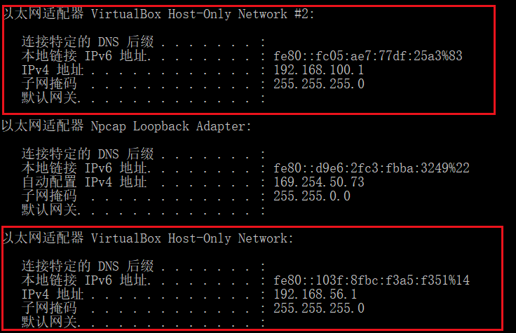
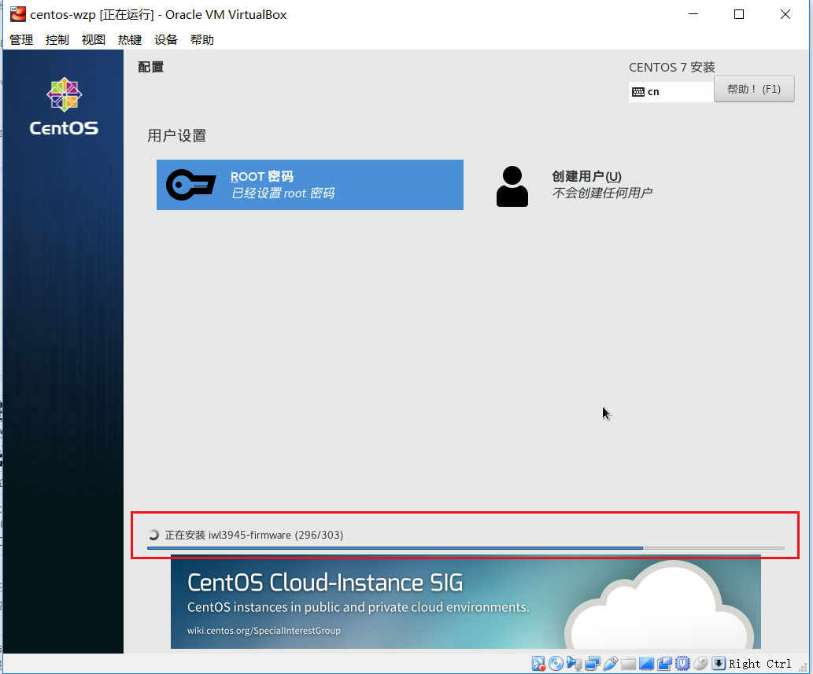
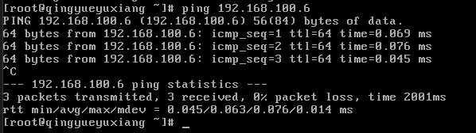

# 服务计算课程Service computing Course——任务一：安装配置私有云

本文总阅读量次

## 前言

本次实验是服务计算课程的第一次实验，是使用 VirtualBox 这样的开源软件搭建自己使用的桌面云的一次实验。

## 1、实验目的

    1.初步了解虚拟化技术，理解云计算的相关概念
    2.理解系统工程师面临的困境
    3.理解自动化安装、管理（DevOps）在云应用中的重要性

## 2、实验环境与要求

- 用户通过互联网，使用微软远程桌面，远程访问你在PC机上创建的虚拟机
- 虚拟机操作系统 Centos，Ubuntu，或 你喜欢的 Linux 发行版，能使用 NAT 访问外网。

PS:实验需要硬件虚拟化（AMD-V 或 Intel-VT）支持，部分旧笔记本不支持。

## 3、实验内容

### 1.安装 VirtualBox

- 安装 Git 客户端（git bash），下载地址：[官网](https://git-scm.com/downloads/)，或 [gitfor windows](https://gitforwindows.org/) 或 [github desktop](https://desktop.github.com/)

   - 此处我很久之前已经装好(git bash)，几乎没有难度，完全可以说是傻瓜操作：
   
      

- 安装 Oracle VirtualBox **5.X**，[官方下载](https://www.virtualbox.org/)

   - 这里教程的要求是5.X，而我之前装有的VirtualBox是6.0版本的，因此为了避免之后出现难以解释的错误，就重新安装了5.3.32版本：
    
       

- 创建虚拟机内部虚拟网络，使得 Vbox 内部虚拟机可以通过它，实现虚拟机之间、虚拟机与主机的通讯

   - VirtualBox菜单 ：管理 -> 主机网络管理器，创建一块虚拟网卡，网址分配：192.168.100.1/24

      

    - 在主机 windows 命令行窗口输入 ipconfig 就可以看到 VirtualBox Host-Only Network #?: 的网卡:

       

### 2.安装Linux虚拟机
- 下载 Linux 发行版镜像(此处装载 [Centos7](https://www.centos.org/download/),其中的 **Minimal ISO** 即可)

- 用 VBox 创建虚拟机。
    
    - 基本信息及内存大小分配设置

       

       这里我分配了4G内存以备不时之需。

    - 接来下设置存储大小，教程要求至少30G，因此我设置了40G，同时需要将文件位置放到固态硬盘(非系统盘)上去。

       

    - 网络设置

       **第一块网卡必须是 NAT；第二块网卡连接方式： Host-Only，接口就是前面创建的虚拟网卡**

       **第一块网卡的设置(对后面的网卡开启等操作有至关重要的影响)：**
       
        首先在virtualbox的全局设置：

        

        然后对第一张网卡进行设置：

        
          
        对第二张网卡进行设置：

        

    - 此时从严格意义上讲并没有开始装该Linux虚拟机，只是准备好了环境(容器)。

- 安装Base虚拟机，利用虚拟化软件提供的虚拟机复制功能，避免每次安装 OS 系统的痛苦

    - 双击进入虚拟机，选择上面刚下载的*VirtualBox-5.2.32-132073-Win.exe*即可，然后进入该界面：
    

    - 然后进入初始信息交互界面进行设置，如对root的密码设置：

    

    

    - 设置完重启登录即可

    

    - 升级 OS 系统内核

       - 此时直接获取wget(yum install wegt)，发现网络没有配置好而导致出现错误(详细截图当问题出现时没有截图，后解决自然也无法再截取到)

       - 因此在查阅资料以及询问隔壁已经遇到过相似问题的dalao们后成功解决——修改网卡设置(启用网卡)：

          - 进入/etc/sysconfig/network-scripts目录，这着实有点“玄奇”，因为从初始界面使用ls指令发现并没有/etc这个子目录，但遵循此路径我是能够最后进入到/network-scripts目录的：

          

          - 发现该目录下有此两个文件，使用vi通过vim对其内的参数ONBOOT进行从no到yes的设置：

          

          

       - 此后再进行yum install wegt和yum update成功完成OS的升级。

       - 检查网卡配置——配置网络的UI界面 nmtui，配置第二块网卡地址：

        

        

        

       - ping 主机，即ping 192.168.100.1,(需在关闭防火墙的条件下)

          

       - ping 外网，如 www.baidu.com

          

    - 退出并关闭虚拟机

- 安装虚拟机

   - 点击 centos-wzp 选择复制，输入新虚拟机的名，注意必须 **选择重新初始化所有网卡的 MAC 地址**

      

   - 然后选 **链接复制**

      

   - 配置主机名和第二块网卡

      - 使用 nmtui 修改主机名和第二块网卡IP地址(此处我修改为192.168.100.6)

      - 重启
    
      - 在主机上，应能 ping 到这个地址，且能通过 ssh 访问该虚拟机（windows 需启动 git bash）

         

         

    - 若使用 vim：

       - 在安装完Centos7后，它默认安装了vi编辑器，vim是没有安装的，可直接使用 **yum -y install vim\*** 指令安装

          

    - 若使用C/C++开发工具，则直接使用 **# yum groupinstall 'Development Tools'**  即可：

       
       
       #### c++:
       
       
       #### c:
       

    - 使用 centos 桌面:

        - 直接安装桌面： 

        > yum groupinstall "GNOME Desktop"

        - 安装完成后输入:

        > startx

        - 即可进入centos桌面

    - 安装Chrome
    
       - 此处会发现没法使用中文拼音输入法

          

          
          
          再在语言设置中添加中文拼音即可

       - [CentOS7 使用 yum 安装 chrome](https://blog.csdn.net/pmlpml/article/details/70953626)

          - 此处我装的是开发版(unstable)，不知道以后会不会有影响，虽然跟教程的稳定版不太一样，但就这么用吧。

          **PS**:**对于RPM和DEB的适用系统可参考该**[博客](http://blog.sina.com.cn/s/blog_927f92c80101d68t.html)

          

          **成功**

### 3.配置用远程桌面访问该虚拟机

   - 参考： [如何设置VirtualBox虚拟机远程访问模式](https://www.jianshu.com/p/6f0f35fa2c4f)

   - 截图如下：

      

   - 虚拟机无界面启动，用户即可通过网络，使用RDP客户端访问

       ——来自同窗的win10笔记本的界面

## 4、感言

   本次基于VirtualBox装载centos7系统的实验是一次埋坑较多的实验，在这个过程中我查阅了大量的博客和相关资料，在这就不在一一列出参考链接了(着实忘了是哪些了)，同时也非常感谢farthjun在此过程中的一些难点处的指导钻研。

## 5、题外话

   还是要把教程中的所有内容搬到这里来以完成实验报告：
   
   - 以上一些操作内容仅适用宿主（hosted）为 window 10 环境，安装 CentOS 7 的操作。

   - 一些可供参考的连接：

      - [docker 集群网络规划与 VM 网络配置](https://blog.csdn.net/pmlpml/article/details/53786382)

      - [VirtualBox 安装 Centos 7 笔记](https://blog.csdn.net/pmlpml/article/details/51534210)

   - 咱下次再见咯！

   