# 服务计算课程Service computing Course——任务二：使用Go语言编程(安装gGo语言开发环境)

本文总阅读量次

## 前言

本次实验是服务计算课程的第二次实验，是基于 VirtualBox 在centos7上进行Go语言开发环境环境和使用Go语言编程的一次实验。

## 1、实验目的

  1. 基于课程网站的内容进行相关环境和工具的安装(不在实验报告要求内，简略编写)

  2. 了解 go 语言基础语法，初步掌握 go 语言编程技术

## 2、实验环境与要求

- 仔细阅读 [官方文档](https://go-zh.org/doc/code.html) 如何使用Go编程 ，并按文档写第一个包，做第一次测试。

- 基于VirtualBox的 centos7系统 虚拟机

## 3、实验内容

   ### 1. go语言编程环境的安装

   - 主要是参考 [课程主页的内容](https://pmlpml.github.io/ServiceComputingOnCloud/ex-install-go)  ，但本着能不科学就不科学的原则，很多时候该网站上的内容较难顺利实现；由于报告要求并没有要求详细编写这一段，因此我当时并没有进行相关截图，故通过回忆来写几个重要的节点：

     - 首先是接上次实验，我把增强功能重新装上，但是在装的时候一直报有“No package nginx available. Error: Nothing to do”之类的错误，通过排查得知很大一部分原因是源地址获取出现莫名其妙的错误，因此我使用了指令  yum install -y epel-release 对epel-release进行安装(若还是报错可通过此二条指令进行操作yum clean all 和 yum makecache)，从而为之后的各种包资源的获取安装奠定环境基础。(详细内容可参考该[博客](https://blog.csdn.net/kikajack/article/details/79711082))

     - 此后便是安装vscode编辑器和安装golang(通过上一点的操作可以避免无法获取的情况)以及在vscode上关于go的一些工具。其中在安装vscode工具的时候会遇到源无法获取的情况，可以通过课程网站的内容加以镜像获取然后在本地复制到相关文件目录下，但是在进行所有工具安装的时候还是会有几个包没有获取到，原因可能是课程网站上的内容时多年前就已经搭建的，现在来说已经有所更新，因此可以跟据错误提示自行到github上面查找相关资源然后使用与教程相同的方法进行本地拷贝然后就可以愉快地完成安装了。

   ### 2、使用Go编程

   1. 原理：

   Go代码必须放在工作空间内。它其实就是一个目录，其中包含三个子目录：

- src 目录包含Go的源文件，它们被组织成包（每个目录都对应一个包），
- pkg 目录包含包对象，
- bin 目录包含可执行命令。

其中go 工具用于构建源码包，并将其生成的二进制文件安装到 pkg 和 bin 目录中。

src 子目录通常包会含多种版本控制的代码仓库（例如Git或Mercurial）， 以此来跟踪一个或多个源码包的开发。

   2. 设置环境变量：

   使用以下指令来设置：

   >>> vi ~/.profile
   
   >>> export GOPATH=$HOME/gowork
   
   >>> export PATH=$PATH:$GOPATH/bin

   3. 根据教程设置包路径为之后保证它不会与将来添加到标准库， 或其它扩展库中的包相冲突，教程语句如下：

   >>> mkdir -p $GOPATH/src/github.com/user

   其中user是自己的名字：

   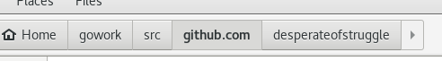

   4. 我的第一个程序

   - 创建文件路径

   >>> mkdir $GOPATH/src/github.com/desperateofstruggle/hello

   

   - 然后输入：

   >>> code hello.go

   - 从而开启vscode并在其中进行编码

   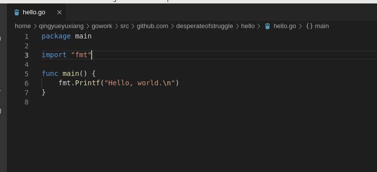

   - 使用go工具构建并安装程序：

   >>> go install github.com/desperateofstruggle/hello

   - PS：可以在系统的任何地方运行此命令。go 工具会根据 GOPATH 指定的工作空间，在 github.com/user/hello 包内查找源码。

   - 现在已能在命令行下输入它的完整路径来运行它了(已经将 $GOPATH/bin 添加到 PATH 中了，只需输入该二进制文件名即可)：

   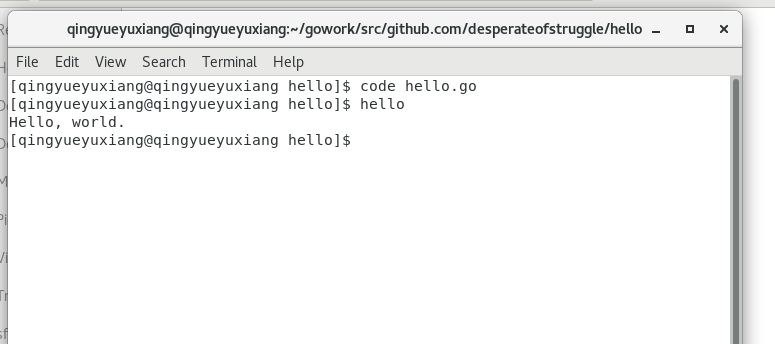

   5. 我的第一个库

   - 选择并创建包目录

   >>> mkdir $GOPATH/src/github.com/desperateofstruggle/stringutil

   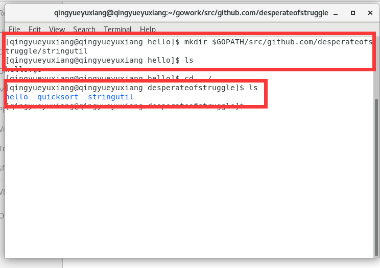

  - 接着，在该目录中创建名为 reverse.go 的文件：

    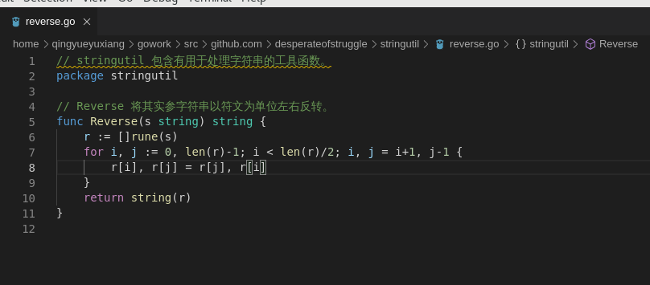

  - 使用go build指令来测试该包的编译：

    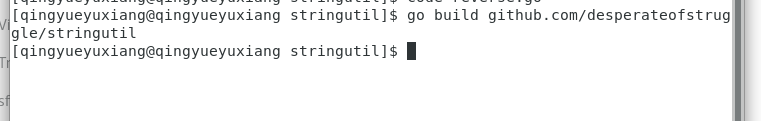
  
  - ok！No news is good news!

  - 用 go install 将包的对象放到工作空间的 pkg 目录中。

    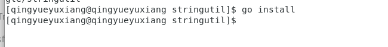

  - 修改原来的 hello.go 文件：

    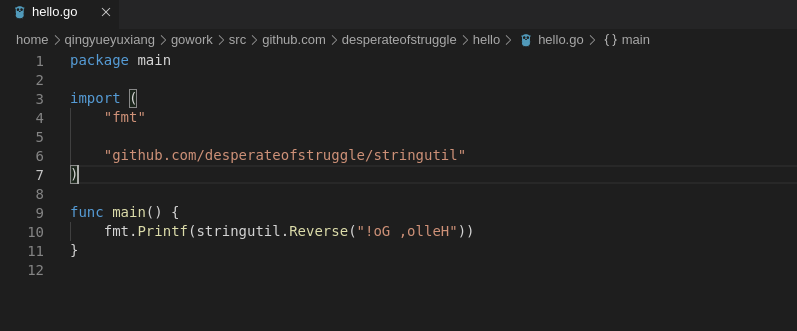

  - install 并运行hello

    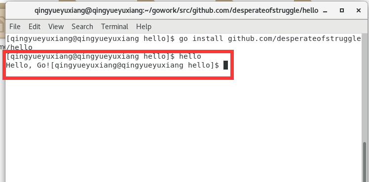

  - 根据教程所述，这时工作空间将是：

    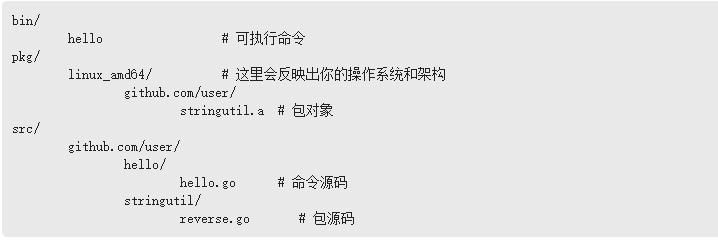

  - 而我的空间为：

    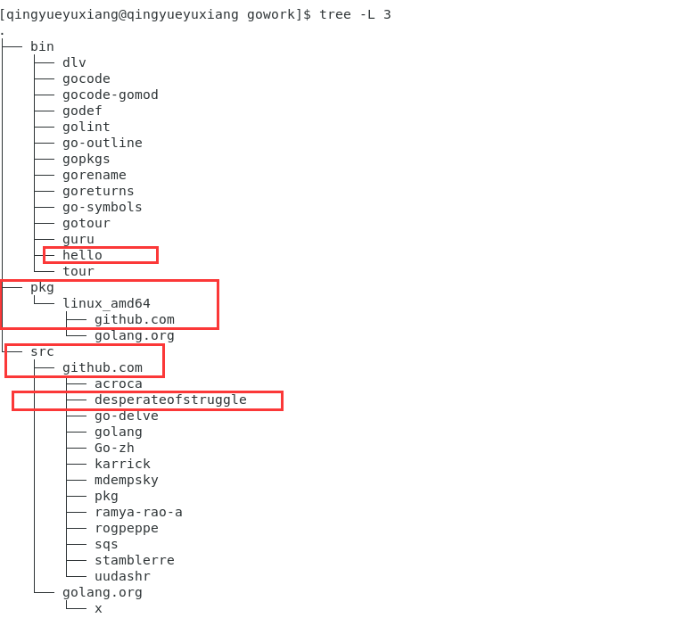

    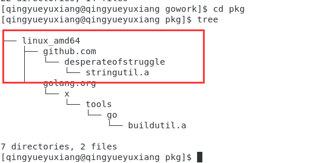

    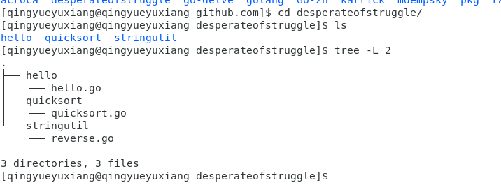

   6. 测试

   - Go拥有一个轻量级的测试框架，它由 go test 命令和 testing 包构成。

   - 可以通过创建一个名字以 _test.go 结尾的，包含名为 TestXXX 且签名为 func (t *testing.T) 函数的文件来编写测试。 测试框架会运行每一个这样的函数；若该函数调用了像 t.Error 或 t.Fail 这样表示失败的函数，此测试即表示失败。

   - 可通过创建文件 $GOPATH/src/github.com/desperateofstruggle/stringutil/reverse_test.go 来为 stringutil 添加测试：

     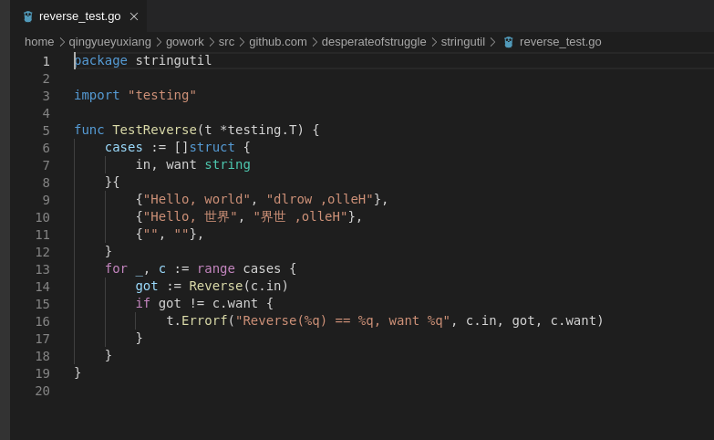

   - 接着使用 go test 运行该测试:

     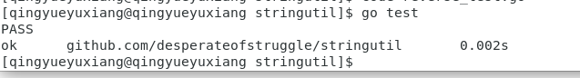

   - 完毕

## 4、总结和感言

 - 本次实验的主要任务是在上一次实验的基础上搭建的centos7系统中搭建go语言开发环境和使用go语言进行简单的编程及测试；最终我于此间学会了go语言基本的语法和基于go语言的开发的一些最基本的注意事项。

