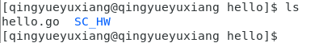
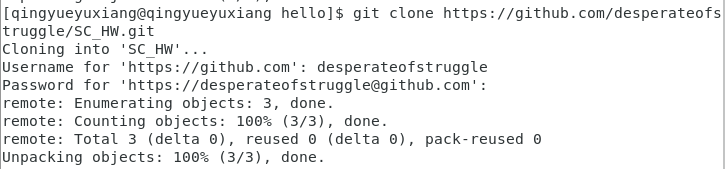
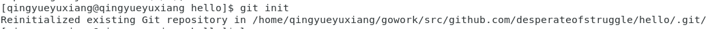
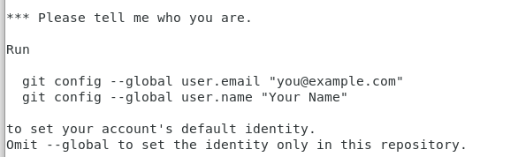
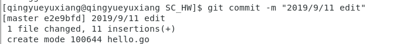
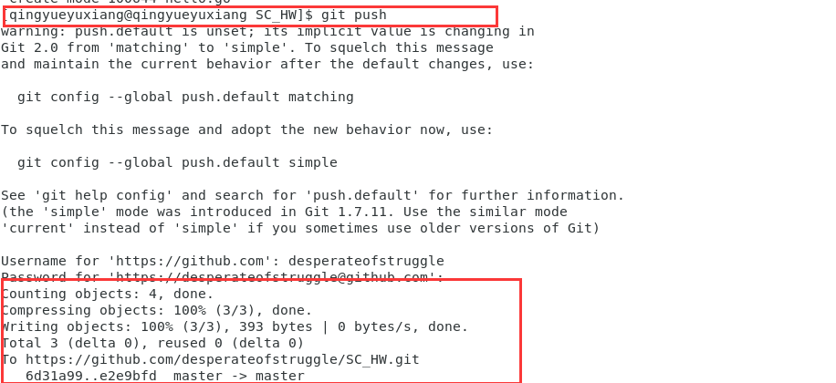
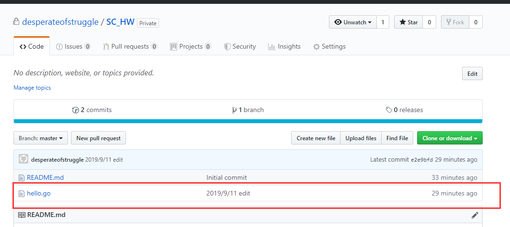

# 创建 git 本地仓库并绑定 github 对应的远程仓库

本文总阅读量次

## 前言

- 以编写 hello.go 为例，我们需要使用 Git 在 github.com/github-user/hello 目录下创建 git 本地仓库并绑定 github 对应的远程仓库。常见的操作包括拉取、提交、同步等。尽管 vscode 能解决常用操作， 一旦出现错误 git 命令就是救命稻草。

## 过程

1. 首先在本地创建一个工作目录

>>> mkdir hello

&emsp;

2. 然后编写hello.go并保存

&emsp;

3. 然后在github上创建库(我在此处设置为private的以便隐私管理，public亦可)：

&emsp;

4. 然后在当前目录clone此库(由于private库因此需要)：

&emsp;

5. 添加文件进入该SC_HW目录下并git init：

&emsp;

git init:

&emsp;

6. 使用git add . 它会监控工作区的状态树，会把工作时的所有变化提交到暂存区

&emsp;

7. 然后对全局信息进行设置：

&emsp;

8. 之后使用git commit -m "xxx"指令将本地暂存的修改提交到版本库，其中-m是用于添加提交信息。

&emsp;

9. 此后git push将本地版本库的分支推送到远程服务器：

&emsp;

10. 到github上查验：

&emsp;

- 完毕

### PS：注意：请使用 https 协议操作远程仓库， 不要使用 git 协议。 请在使用网络资源时务必注意！