# CLI 命令行实用程序开发基础

<script async src="//busuanzi.ibruce.info/busuanzi/2.3/busuanzi.pure.mini.js"></script>
<span id="busuanzi_container_page_pv">本文总阅读量<span id="busuanzi_value_page_pv"></span>次</span>

## 前言

本次实验是服务计算课程的第三次实验，是以golang开发selpg的一次实验。

[Go-Online代码分享链接](http://139.9.57.167:20080/share/bm6a1smd0lil884fajdg?secret=false)：http://139.9.57.167:20080/share/bm6a1smd0lil884fajdg?secret=false

---


## 1.概述

&emsp;&emsp; CLI（Command Line Interface）实用程序是Linux下应用开发的基础。正确的编写命令行程序让应用与操作系统融为一体，通过shell或script使得应用获得最大的灵活性与开发效率。Linux提供了cat、ls、copy等命令与操作系统交互；go语言提供一组实用程序完成从编码、编译、库管理、产品发布全过程支持；容器服务如docker、k8s提供了大量实用程序支撑云服务的开发、部署、监控、访问等管理任务；git、npm等都是大家比较熟悉的工具。尽管操作系统与应用系统服务可视化、图形化，但在开发领域，CLI在编程、调试、运维、管理中提供了图形化程序不可替代的灵活性与效率。

## 2.实验环境与要求

- 基于VirtualBox的 centos7系统 虚拟机
- 使用 golang 开发 开发 [Linux 命令行实用程序](https://www.ibm.com/developerworks/cn/linux/shell/clutil/index.html) 中的 selpg
- 按文档 使用 selpg 章节要求测试程序
- 使用 pflag 替代 goflag 以满足 Unix 命令行规范， 参考：[Golang之使用Flag和Pflag](https://o-my-chenjian.com/2017/09/20/Using-Flag-And-Pflag-With-Golang/)
- golang 文件读写、读环境变量，查 os 包
- “-dXXX” 实现，查 os/exec 库，例如案例 [Command](https://godoc.org/os/exec#example-Command)，管理子进程的标准输入和输出通常使用 io.Pipe，具体案例见 [Pipe](https://godoc.org/io#Pipe)

PS：所谓使用pflag代替goflag以满足命令行规范，其实使用goflag也能基本实现,规范可参考[大全](https://max.book118.com/html/2018/0521/167770458.shtm)
---

## 3.相关工具的安装

   - 由于教程文档中的提示要求使用 pflag 替代 goflag 以满足 Unix 命令行规范，因此需要安装在golang中没有自带的pflag包。(两者应用方式类似且pflag[功能更强](https://blog.csdn.net/qq_34857250/article/details/100569688))

        ```go
        //获取安装
        go get github.com/spf13/pflag

        //检测
        go test github.com/spf13/pflag

        //使用
        import "github.com/spf13/pflag"

        ```
        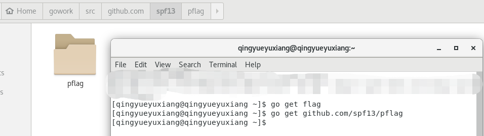

        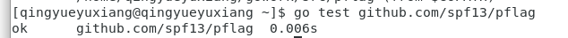

        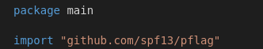

   - 
   ---

## 4.原理的学习

   ### 1.pflag

   - 命令行语法

   ```go
    --flag    // 布尔flags, 或者非必须选项默认值
    --flag x  // 只对于没有默认值的flags
    --flag=x
   ```

   - 两种绑定变量的方法

   ```go
   pflag.IntVar(&pflagvar, "pflagname", "h", 1234, "help message")

   或
   var pflagvar int

   pflagvar = pflag.IntVar("pflagname", "h", 1234, "help message")

   ```

   - 与flag不同之处
   
     - 添加shorthand参数
     ```go
     var pflagvar= pflag.IntP("pflagname", "h", 1234, "help message")
     ```

     - 设置非必须选项的默认值
     ```go
     var pflagvar = pflag.IntP("pflagname", "h", 1234, "help message")
     pflag.Lookup("pflagname").NoOptDefVal = "9999"
     ```
     与 flag 包不同，在 pflag 包中，选项名称前面的 -- 和 - 是不一样的。- 表示 shorthand，-- 表示完整的选项名称。
     对于布尔类型的参数和设置了 NoOptDefVal 的参数可采取如下形式:
     ```go
     -h
     -h=true
     ```
     对于非布尔类型的参数和没有设置 NoOptDefVal 的参数可采取如下形式：
     ```go
     -n xx
     -n=xx
     -nxx
     ```
     - 此外，对于其他的功能可参考此[博客](https://o-my-chenjian.com/2017/09/20/Using-Flag-And-Pflag-With-Golang/)，包括同时使用flag和pflag皆可。
   
   - 解析相关：

     - pflag.Parse()：

        解析命令行参数到定义的flag，解析函数将会在碰到第一个非flag命令行参数时停止，非flag命令行参数是指不满足命令行语法的参数。

     - flag.Args()，flag.Arg(i)，flag.NArg()：
     ```go
     使用方法(与flag相同)：
     fmt.Println(pflag.NArg()) // 返回解析后参数的个数。
     for i, arg := range pflag.Args() {
        fmt.Printf("%s %s\n", pflag.Arg(i), arg) // 返回第i个命令行参数。
     }
     ```

   ### 2.golang 文件读写、读环境变量， os 包
   - 关于bufio可参考此[网页](https://cloud.tencent.com/developer/section/1140430)或此[网页](https://www.baidu.com/link?url=akpRz2AuVVM_Fp3zk2DmEF1qlP5BRdOpGVVNDHOS1RFbuJayOG0klEG8snOafYAp&wd=&eqid=8a7cdde30005c591000000065d8c4cb2)
   ---

## 5.设计实现(总体思想源于selpg的.c实现)

   ### 1) 依赖包
```go
   import (
        "bufio"
        "fmt"
        "io"
        "os"
        "os/exec"
        "strings"

        "github.com/spf13/pflag"
    )
```

   ### 2) 关键结构体

   ```go
    type selpgArgs struct {
        startPage  int
        endPage    int
        inFilename string
        printdest  string
        pageLen    int
        pageType   string //  "l" for line-based "f" for "/f"
    }
   ```
   分别对应一种参数。

   ### 3) 参数指引

   ```go
   格式：
    selpg [-s start] [-e end] [-l linenums | -f] [-d outdest] [inputfilename]
   ```

   ```go
    func usage() {
        fmt.Printf("Usage: selpg [-s start] [-e end] [-l linenums | -f] [-d outdest] [inputfilename]\n\n")
        fmt.Printf("Notices:\n")
        fmt.Printf("  -s Number  : start page <Number>.\n")
        fmt.Printf("  -e Number  : end Page <Number>.\n")
        fmt.Printf("  -l Number  : <Number> lines each page. (Default : 72)\n")
        fmt.Printf("  -f         : char '\\f' as the page cut. (Conflict with -l)\n")
        fmt.Printf("  -d Command : <Command> the pipe destination command.(Default : \"\")\n")
        fmt.Printf("  infilename : input file. （Default : stdin. Ps : press Ctrl-D for end)\n\n")
    }
   ```

   ### 4) 参数绑定与合理性判断

   ```go
    pflag.Usage = usage
	pflag.IntVarP(&args.startPage, "s", "s", -1, "Start Page")
	pflag.IntVarP(&args.endPage, "e", "e", -1, "End Page")
	pflag.IntVarP(&args.pageLen, "lop", "l", -0x7f7f7f7f, "Line number of each page")
	pflag.StringVarP(&args.printdest, "dop", "d", "", "the destination of the printer")
	f := pflag.BoolP("xxf", "f", false, "Line cutoff methods")
	pflag.Parse()
   ```
   其中f为用于判断-f类型还是-l类型的页切割方法，判断如下(初始化-l的默认值为极小的负数):

   ```go
    /* check if the -f and -l appear together and assign */
	if *f && args.pageLen == -0x7f7f7f7f {
		args.pageType = "f"
		args.pageLen = -1
	} else if *f && args.pageLen != -0x7f7f7f7f {
		fmt.Fprintf(os.Stderr, "%s: -f and -l cannnot be the input at the same time\n", progname)
		usage()
		os.Exit(1)
	} else if !*f && args.pageLen == -0x7f7f7f7f {
		args.pageType = "l"
		args.pageLen = 72
	} else {
		args.pageType = "l"
	}
   ```
   参数合理性判断：

   一、是否有输入文件

   二、页码start和end是否符合前者<=后者的要求 

   三、页码有无超范围(在输入处理函数、过程中)

   ### 5. 输入处理-->输出

   1. 利用os库来进行输入文件的数据读入

   2. 若printdest不为空，则需要将管道(原指向打印机，但此处没有，为检验效果)指向cmd的标准输出。

   3. 利用bufio库中的Scanner和Reader以及strings库中的相关方法对数据进行处理并输出。

   (由于源码相对较长占篇幅较多，详细过程见源代码(在本文最上方部分))

   <font color = "red">关键流程：</font>

   1） 判断是否无法打印到需求的s(起始页码)->e(结束页码)页：

   对-l形式：

    1.for line-read

        i).if currentpage inside the startpage and endpage->output

        ii).currentline++

        iii).currentline > perpageline

            if currentpage inside the startpage and endpage->output -> finished one page

            currentpage++ and currentline->0

    2.if currentpage < endpage  ->  error

    3.else finish

   对-f类似。

---

## 5.测试数据生成

此处我使用了python来生成了两个测试数据文件，分别对应-l和-f的输入方式：

```python
import os

def main():
    file_test1 = "./input1.txt"
    file_test2 = "./input2.txt"
    cnt = 0
    for cnt in range(100):
        with open(file_test2, "a+") as f:
            f.write("statement " + str(cnt))
        if cnt % 3 == 0 or cnt % 5 == 0 :
            with open(file_test2, "a+") as f:
                f.write(str('\f'))
    cnt = 0
    for cnt in range(100):
        with open(file_test1, "a+") as f:
            f.write("Line " + str(cnt) + "\n")


if __name__ == '__main__':
    main()

```


---

## 6.实验结果与分析

PS:基于教程网站的"使用selpg"模块进行详细的测试——<font color = "yellow">这里为了更明显的看出页数和终止，我在输出增添了一些提示语句</font>：

- 首先像上次实验那样构建一个个人空间然后go install

   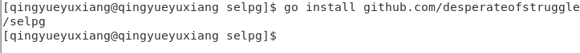

   - 然后使用python脚本生成测试文件input1.txt和input2.txt分别对应以行数分页和以"-f"分页的两种模式

   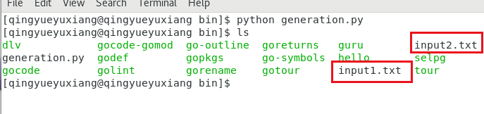

- 1. ```$ selpg -s1 -e1 input_file```

     该命令将把“input_file”的第 1 页写至标准输出（也就是屏幕），因为这里没有重定向或管道。

     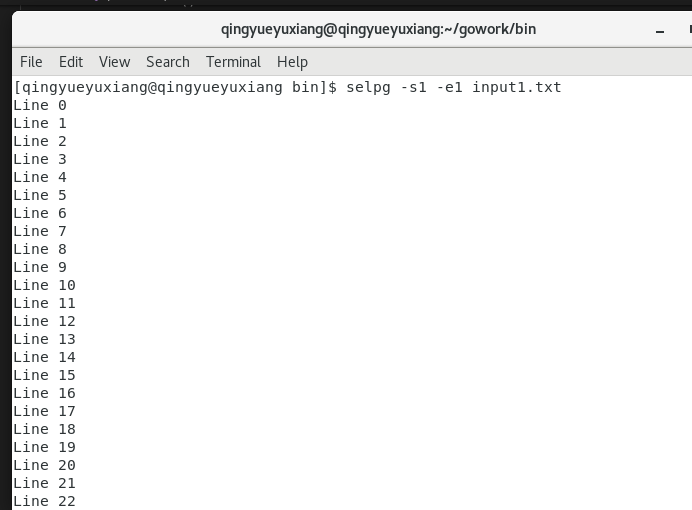

     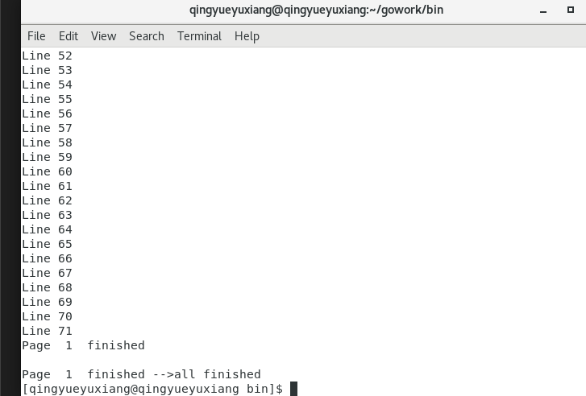
     
     此处从Line0开始，到Line71正好72行符合默认分页行数为72的要求

   
- 2. ```$ selpg -s1 -e1 < input_file```

    该命令与示例 1 所做的工作相同，但在本例中，selpg 读取标准输入，而标准输入已被 shell／内核重定向为来自“input_file”而不是显式命名的文件名参数。输入的第 1 页被写至屏幕。

    同理，符合：
      
    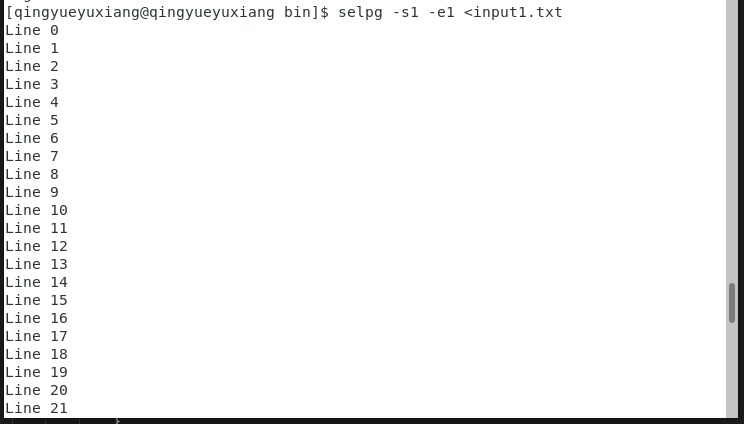

- 3. $ other_command | selpg -s10 -e20

    “other_command”的标准输出被 shell／内核重定向至 selpg 的标准输入。将第 10 页到第 20 页写至 selpg 的标准输出（屏幕）。

    此处我没有生成20*72行那么多。因此调整下参数，此外other_command采用的ls，即ls的标准输出作为了selpg的输入：

    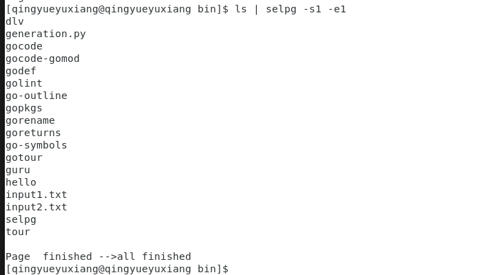

- 4. $ selpg -s10 -e20 input_file >output_file

   selpg 将第 10 页到第 20 页写至标准输出；标准输出被 shell／内核重定向至“output_file”。

   此处我的指令只输出第一页：

    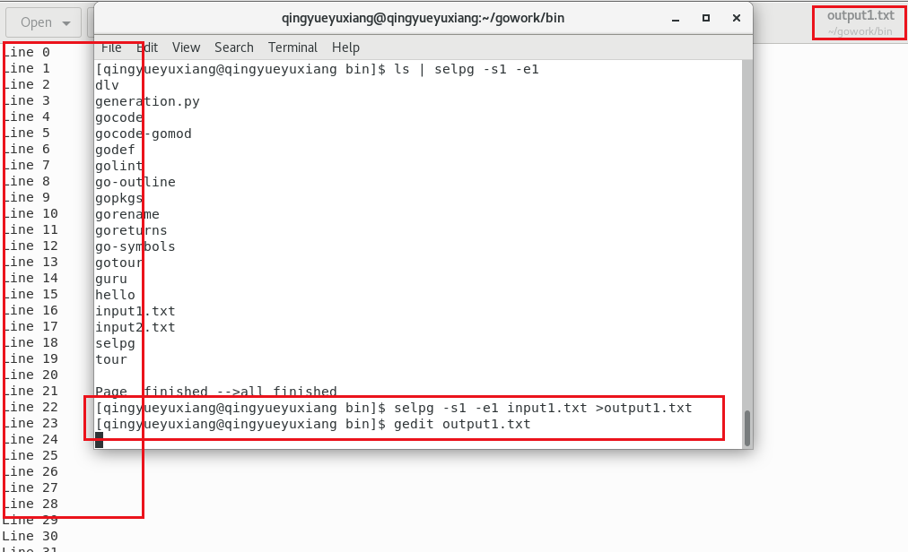

- 5. $ selpg -s10 -e20 input_file 2>error_file
    
    这里采取了一个初始页码比结束页码还大的输入:

    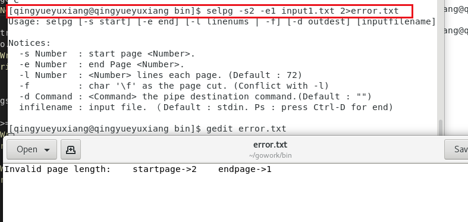

- 6. $ selpg -s10 -e20 input_file >output_file 2>error_file

   这里我一共只有100行，因此采取默认的-l时最多只能2页，因此我设置-s1 -e3：

    在error.txt中：
    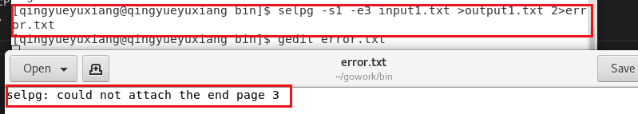

    在output1.txt中：
    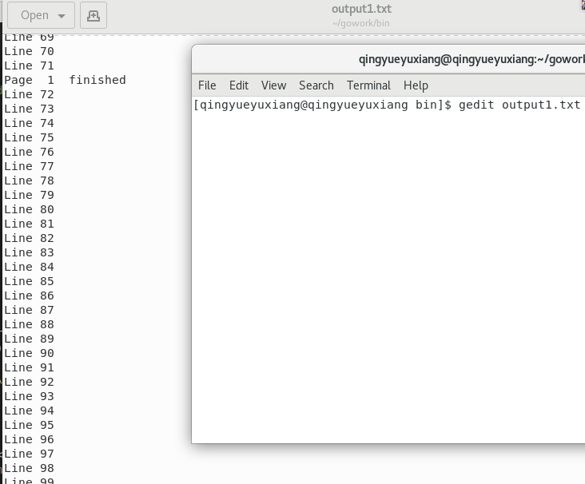

- 7. selpg -s10 -e20 input_file >output_file 2>/dev/null

   selpg 将第 x 页到第 y 页写至标准输出，标准输出被重定向至“output_file”；selpg 写至标准错误的所有内容都被重定向至 /dev/null（空设备），这意味着错误消息被丢弃了。设备文件 /dev/null 废弃所有写至它的输出，当从该设备文件读取时，会立即返回 EOF。
   
   而我采用1-10页(input中并没有这么多页)，则此时只有1-2页(input中只有两页的内容)：
   
   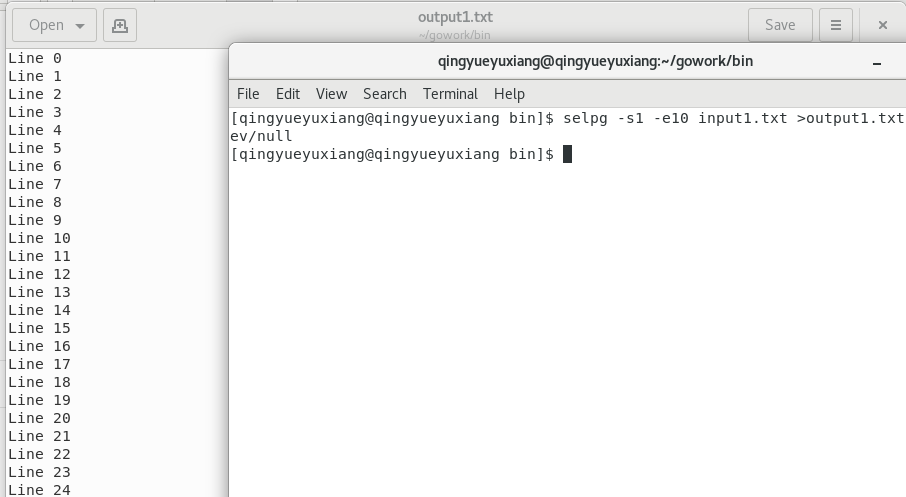

- 8. $ selpg -s10 -e20 input_file >/dev/null
  
   selpg 将第 x 页到第 y 页写至标准输出，标准输出被丢弃；错误消息在屏幕出现。这可作为测试 selpg 的用途，此时您也许只想（对一些测试情况）检查错误消息，而不想看到正常输出。

   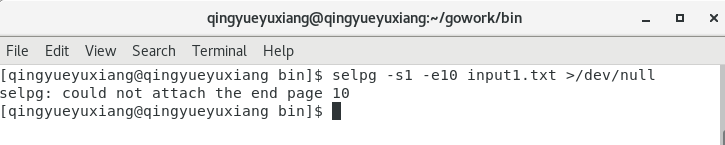

- 9. selpg -s10 -e20 input_file | other_command
   
   selpg 的标准输出透明地被 shell／内核重定向，成为“other_command”的标准输入，第 10 页到第 20 页被写至该标准输入。“other_command”的示例可以是 lp，它使输出在系统缺省打印机上打印。“other_command”的示例也可以 wc，它会显示选定范围的页中包含的行数、字数和字符数。“other_command”可以是任何其它能从其标准输入读取的命令。错误消息仍在屏幕显示。

   

- 10. $ selpg -s10 -e20 input_file 2>error_file | other_command

   与上面的示例 9 相似，只有一点不同：错误消息被写至“error_file”。

   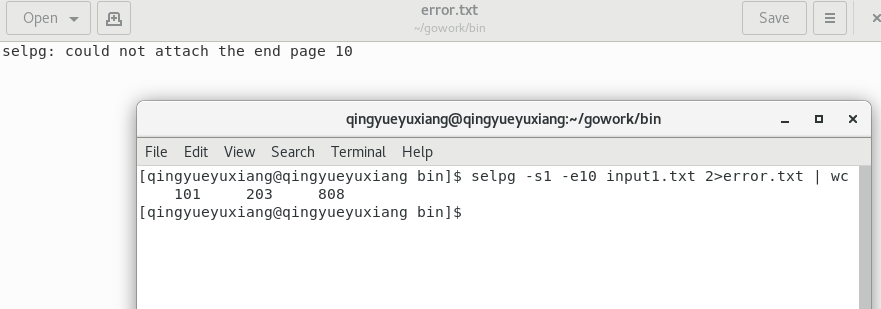

- 11. selpg -s10 -e20 -l66 input_file

   该命令将页长设置为 66 行，这样 selpg 就可以把输入当作被定界为该长度的页那样处理。第 x 页到第 y 页被写至 selpg 的标准输出（屏幕）。

   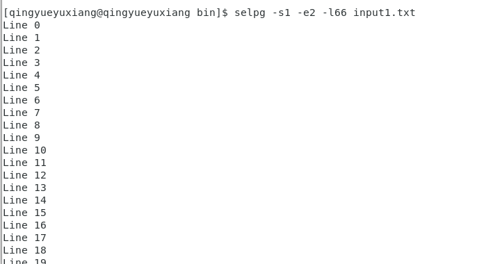

   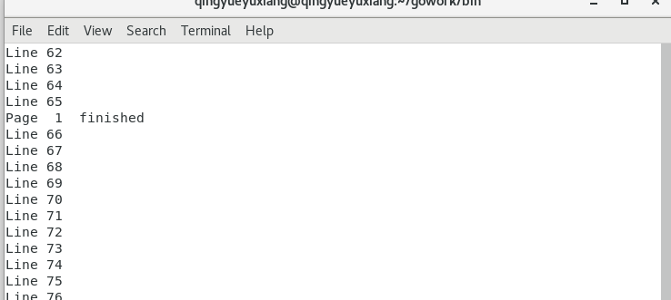

   

- 12. selpg -s10 -e20 -f input_file

   假定页由换页符定界。第 10 页到第 20 页被写至 selpg 的标准输出（屏幕）。

   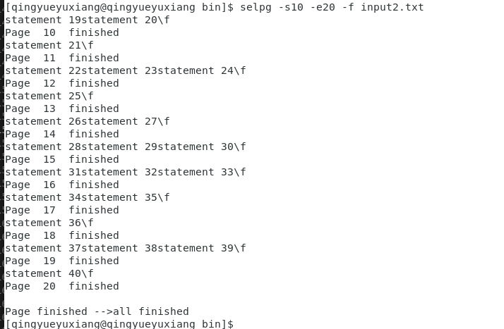
   
        
- 13. $ selpg -s10 -e20 -dlp1 input_file

   第 10 页到第 20 页由管道输送至命令“lp -dlp1”，该命令将使输出在打印机 lp1 上打印。

   由于没有打印机，所以将管道接到了命令行输出：

   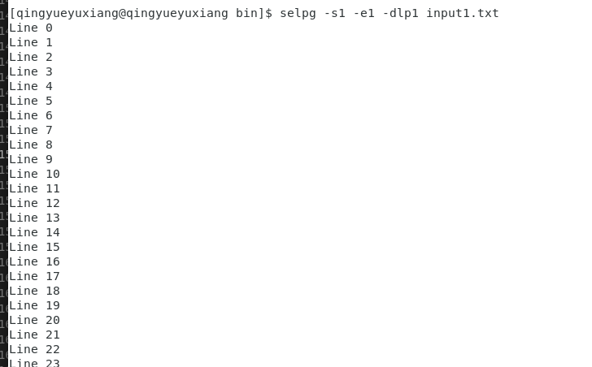

   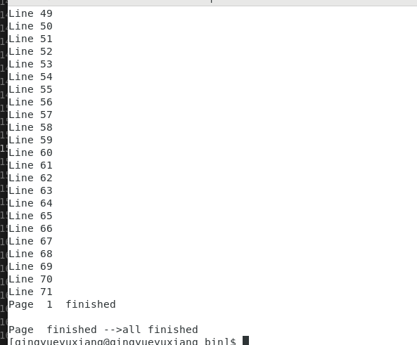

- 14. $ selpg -s10 -e20 input_file > output_file 2>error_file &

   该命令利用了 Linux 的一个强大特性，即：在“后台”运行进程的能力。在这个例子中发生的情况是：“进程标识”（pid）如 1234 将被显示，然后 shell 提示符几乎立刻会出现，使得您能向 shell 输入更多命令。同时，selpg 进程在后台运行，并且标准输出和标准错误都被重定向至文件。这样做的好处是您可以在 selpg 运行时继续做其它工作。

   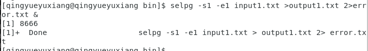

- 实验完成，有效完成任务。

---

## 7.实验心得

 - 本次实验的主要任务是接上一次使用go语言进行简单的编程及测试后进行的一个命令行应用开发，在其中我成功运用到了这几周学习的go语言的各种基本语法，也懂得了pflag，flag，os，bufio，strings，io等库中一些较为实用的函数。收获颇丰。