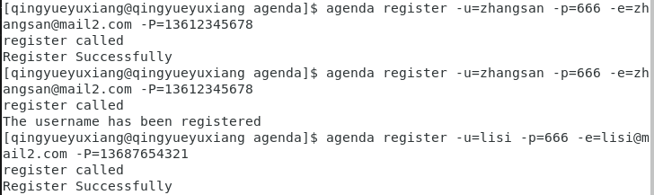

# CLI 命令行实用程序开发实战 - Agenda

<script async src="//busuanzi.ibruce.info/busuanzi/2.3/busuanzi.pure.mini.js"></script>
<span id="busuanzi_container_page_pv">本文总阅读量<span id="busuanzi_value_page_pv"></span>次</span>

## 前言

本次实验是服务计算课程的第四次实验，是以golang开发简单Agenda的一次实验。

[Go-Online代码分享链接](http://139.9.57.167:20080/share/bmkscre76kvs669u2030?secret=false)

因该ide的玄学环境配置问题若涉及权限问题需要作出以下操作：

首先是需要root:
```
su
root
```
然后
```
chmod -R 777 /home
```
赋予文件权限；然后就能正常go run了

- `PS`：但本博客还是以从github上获取到本地进行运行的形式开展。

---

## 1.概述

  命令行实用程序并不是都象 cat、more、grep 是简单命令。go 项目管理程序，类似 java 项目管理 maven、Nodejs 项目管理程序 npm、git 命令行客户端、 docker 与 kubernetes 容器管理工具等等都是采用了较复杂的命令行。即一个实用程序同时支持多个子命令，每个子命令有各自独立的参数，命令之间可能存在共享的代码或逻辑，同时随着产品的发展，这些命令可能发生功能变化、添加新命令等。因此，符合 OCP 原则 的设计是至关重要的编程需求。

  任务目标

    1. 熟悉 go 命令行工具管理项目
    2. 综合使用 go 的函数、数据结构与接口，编写一个简单命令行应用 agenda
    3. 使用面向对象的思想设计程序，使得程序具有良好的结构命令，并能方便修改、扩展新的命令,不会影响其他命令的代码
    4. 项目部署在 Github 上，合适多人协作，特别是代码归并(*由于是单人任务，所以仅有简单的部署而没有归并*)
    5. 支持日志（原则上不使用debug调试程序）

## 2.GO 命令(`在此前的学习中已详细设计，此处为了完美覆盖课程网站上的要求而简略贴出`)

  [GO命令](https://go-zh.org/cmd/go/) 的官方说明并不一定是最新版本。最新说明请使用命令 go help 获取。 关于[GO命令](https://go-zh.org/doc/articles/go_command.html)

  必须了解的环境变量：GOROOT，GOPATH

  [项目目录与 gopath](https://go-zh.org/cmd/go/#hdr-GOPATH_environment_variable)

  其中需要注意其格式和分类，此处不再详细写出。

## 3.准备知识或资源

  - 3.1 Golang 知识整理

    课程网站上介绍的time-track 的个人博客可供参考性较高：

      - [《Go程序设计语言》要点总结——程序结构](http://time-track.cn/gopl-notes-program-structure.html)

      - [《Go程序设计语言》要点总结——数据类型](http://time-track.cn/gopl-notes-types.html)

      - [《Go程序设计语言》要点总结——函数](http://time-track.cn/gopl-notes-function.html)
      
      - [《Go程序设计语言》要点总结——方法](http://time-track.cn/gopl-notes-function.html)

      - [《Go程序设计语言》要点总结——接口](http://time-track.cn/gopl-notes-interface.html)
    
  - 3.2 JSON 序列化与反序列化

    参考：[JSON and Go](https://blog.go-zh.org/json-and-go)
    
    json 包是内置支持的，文档位置：https://go-zh.org/pkg/encoding/json/

  - 3.3  复杂命令行的处理

    - pflag 包： https://godoc.org/github.com/spf13/pflag

    - cobra 包： https://godoc.org/github.com/spf13/cobra

    - goptions 包： https://godoc.org/github.com/voxelbrain/goptions

    - ...

    - docker command 包：https://godoc.org/github.com/docker/cli/cli/command

    <font size = 6>`此处选择使用cobra工具`</font>

## 4. 安装 cobra 并完成教程中的3.3小案例

  - 安装cobra包

  ```
  go get -v github.com/spf13/cobra/cobra
  ```

  - 发现报错无法获取源，即使架代理也无法获取，因此需要寻找对应镜像。

  - 发现仅有两个包无法获取，便如下图般在对应镜像中get clone.

  

  - 然后执行`go get -v github.com/spf13/cobra/cobra`安装即可。

  - 执行完后在/gowork/bin中生成可执行文件

  

  - Cobra 的简单使用——`创建一个处理命令 agenda register -uTestUser 或 agenda register --user=TestUser 的小程序。`
  
    - 开发一个基于CLI的命令程序，名字为tests

    ```
    cobra init tests --pkg-name=tests
    ```

    

    - 测试tests效果：

    

    - 添加子命令register

    ```
    cobra add register
    ```

    

    - 结构树：

    

    - 在register.go, init() 添加：

    ```go
    registerCmd.Flags().StringP("user", "u", "Anonymous", "Help message for username")
    ```

    - 在Run()的匿名回调函数中添加：

    ```go
    username, _ := cmd.Flags().GetString("user")
    fmt.Println("register called by " + username)
    ```

    -  测试命令
    
    

    - 小测试完成

## 5. agenda 开发项目

 <font size=5 color=yellow>由于本次实验更改为单人任务而非课程网站上所述的组队，故只需要实现1-2个功能!</font>
 
 <font size=4 color=lightgreen>在本次实验中的所有需求中，只有完成用户相关才能进行会议相关的实现，因此我从用户中选取最开始必须实现方能继续实验的**用户注册、用户登录和用户登出**功能</font>

 ### 5.1 需求描述

   - 命令需求介绍

     - 用户注册
    
       - 1.注册新用户时，用户需设置一个唯一的用户名和一个密码。另外，还需登记邮箱及电话信息。

       - 2.如果注册时提供的用户名已由其他用户使用，应反馈一个适当的出错信息；成功注册后，亦应反馈一个成功注册的信息。

     - 用户登录

       - 1.用户使用用户名和密码登录 Agenda 系统。

       - 2.用户名和密码同时正确则登录成功并反馈一个成功登录的信息。否则，登录失败并反馈一个失败登录的信息。

     - 用户登出

       - 1.已登录的用户登出系统后，只能使用用户注册和用户登录功能。

  - 需求的指令：

    - agenda help ：列出命令说明

    - agenda register -u [username] -p [password] -e [email] -P [phone] : 注册用户

    - agenda help register ：列出 register 命令的描述

    - login -u [username] -p [password] : 登录

    - logout : 登出

  - 持久化要求：

    - 使用 json 存储 User 实体

    - 当前用户信息存储在 curUser.txt 中

  - 开发需求：

    - 团队：1人

    - 时间：**两周完成**

  - 项目目录

    - cmd ：存放命令实现代码

    - entity ：存放 User 对象读写与处理逻辑

    - 其他目录 ： 自由添加

  - 日志服务

    - 使用 [log](https://go-zh.org/pkg/log/) 包记录命令执行情况

### 5.2 相相关功能及指令的分析与实现

  - 创建agenda

    - `cobra init agenda --pkg-name=agenda`

  - register

    - 指令
      
      ```
      agenda register -u=zhangsan -p=666 -e=zhangsan@mail2.com -P=13612345678
      ```

    - 使用cobra指令`cobra add register`创建/cmd/register.go

    - 绑定参数

      ```go
      registerCmd.Flags().StringVarP(&rName, "username", "u", "", "-u=userName")
        registerCmd.Flags().StringVarP(&rPassword, "password", "p", "", "-p=password")
        registerCmd.Flags().StringVarP(&rEmai, "email", "e", "", "-e=email")
        registerCmd.Flags().StringVarP(&rPhone, "phone", "P", "", "-P=phone")
      ```
    - 首先对输入的参数进行合理性判断，通过正则表达式进行最基本的检验

      - 账号和密码任意字符任意长度

       

      - 邮箱属于一般的"xxx@xxx.xxx"

      ```go
      temp, _ = emp, _ := regexp.Match("^[a-zA-Z0-9_-]+@[a-zA-Z0-9_-]+(\\.[a-zA-Z0-9_-]+)+$", tmp)
      ```

      - 电话号码使用主流的11位手机号

      ```go
      temp, _ := regexp.Match("^(13[0-9]|14[5-9]|15[0-3,5-9]|16[2,5,6,7]|17[0-8]|18[0-9]|19[1,3,5,8,9])\\d{8}$", tmp)
      ```

    - 若检验不通过则反馈信息

    - 若通过则获取现有用户，然后判断是否已经存在同名的user，若存在同名则立刻返回，否则则新建用户并与之前的用户一同存入json文件。

    

  - login

    - 指令

      ```
      agenda login -u=zhangsan -p=666
      ```

    - 使用cobra指令`cobra add login`创建/cmd/login.go

    - 总体过程仍是绑定变量，然后读取所有用户的账号密码信息然后进行比对，如果通过则将登陆的用户名计入curUser.txt中以记录已登录。(详见源代码)


  - logout

    - 指令

    ```
    agenda logout
    ```

    - 此指令的实现是直接从curUser.txt中读取已登录用户名单，若存在，则直接从文件中删去即可。(详见源代码)

  - 用户相关文件读取

    - 建立一个userStorage.go的功能接口文件

    - 利用ioutil库的ReadFile和WriteFile接口以及json库的Unmarshal接口来对存储所有用户的.json文件中的数据进行读取。

    

    

    
    
    - 同样利用ioutil库的方法读写存储已登录用户信息的txt文件，其中读取已登录用户的方法中还需要通过string格式的用户名来遍历所有用户而获取用户对象。

    

  - log的实现

    - 通过绑定*os.file 与 *log.Logger来实现利用log库的方法形成日志；此处参考网上博客，使用logInit()与logSave()两个函数来实现对log.json的读取与添加！

    

## 6. agenda的使用与测试

  - 首先需要构建好goLang的工作环境，然后对目标agenda进行以下指令

  ```
  go install github.com/desperateofstruggle/agenda
  ```

&emsp;&emsp;&emsp;路径如下
  
  

&emsp;&emsp;&emsp;树结构如下：

  

  - 然后在该目录下(为程序能使用到data子目录中的各数据文件)进行测试！

  - agenda register(按顺序执行)

    ```
    agenda register -u=zhangsan -p=666 -e=zhangsan@mail2.com -P=13612345678
    agenda register -u=zhangsan -p=666 -e=zhangsan@mail2.com -P=13612345678
    agenda register -u=lisi -p=666 -e=lisi@mail2.com -P=13687654321
    agenda register -u=wangwu -p=666 -e=lisi%mail2.com -P=falseformat
    agenda register -u=maliu 
    ```
    前面三条会出现两次注册zhangsan，后面两条则是输入格式不符合或缺省不符合要求：

    

    

    日志中：

    

    用户json文件中：

    

  - agenda login

    ```
    agenda login -u=zhangsan -p=666
    agenda login -u=zhangsan -p=6666666
    agenda login -u=lisi -p=666
    等
    ```

    上面的指令需要结合logout来检测


  - agenda logout

    ```
    agenda logout
    ```

    结合login的测试集:

    ```
    agenda login -u=zhangsan -p=666
    agenda login -u=lisi -p=666
    agenda logout
    agenda login -u=zhangsan -p=6666666
    agenda login -u=lisi -p=666
    agenda logout
    agenda login -u=wangwu -p=undefined
    agenda logout
    ```

    前三条指令是测试不能同时多账号登录：

    

    指令4测试错误密码：

    

    指令5-7测试未注册用户的尝试登录以及无登录状态下的登出：

    

    日志：

    

    zhangsan登录后的curUser.txt：

    

  - 测试成功，实验完成！

## 7.实验心得

  - 本次实验的主要任务是接上一次使用go语言进行简单的selpg命令行应用开发之后的另一个应用agenda的开发，在本次实验中我成功学习到了包括pflag和本次使用的cobra在内的多种复杂命令行应用开发处理工具，也对go语言在JSON上的使用，同时也对log包(库)有了基本的使用了解，收获颇丰。

