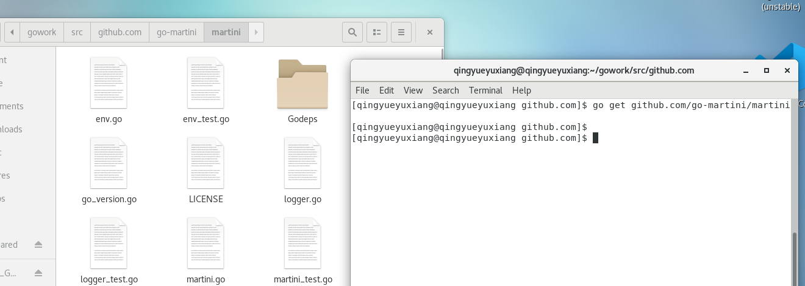
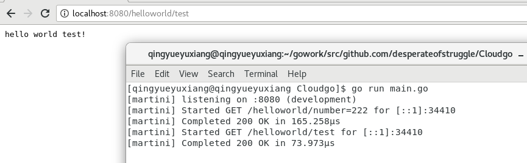
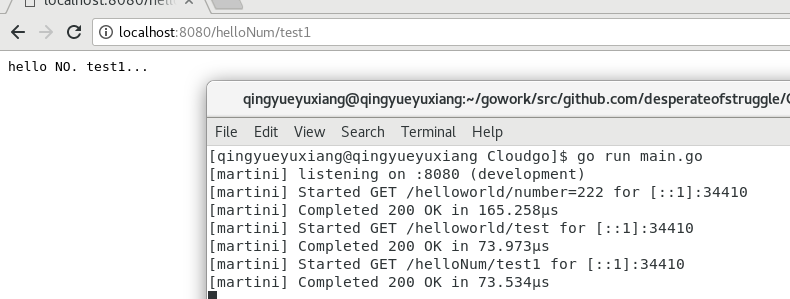
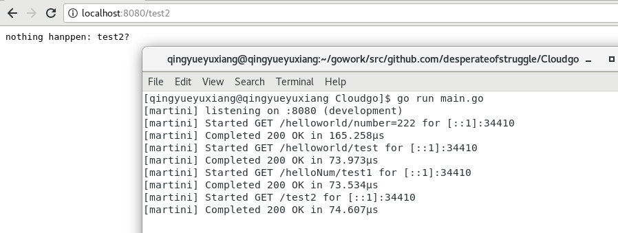
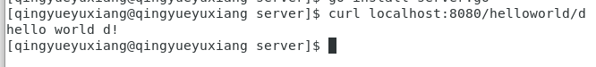
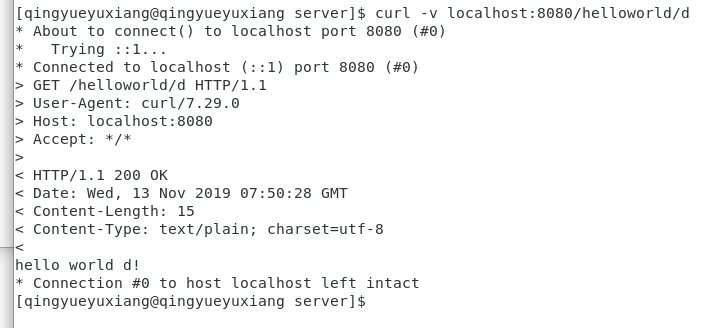
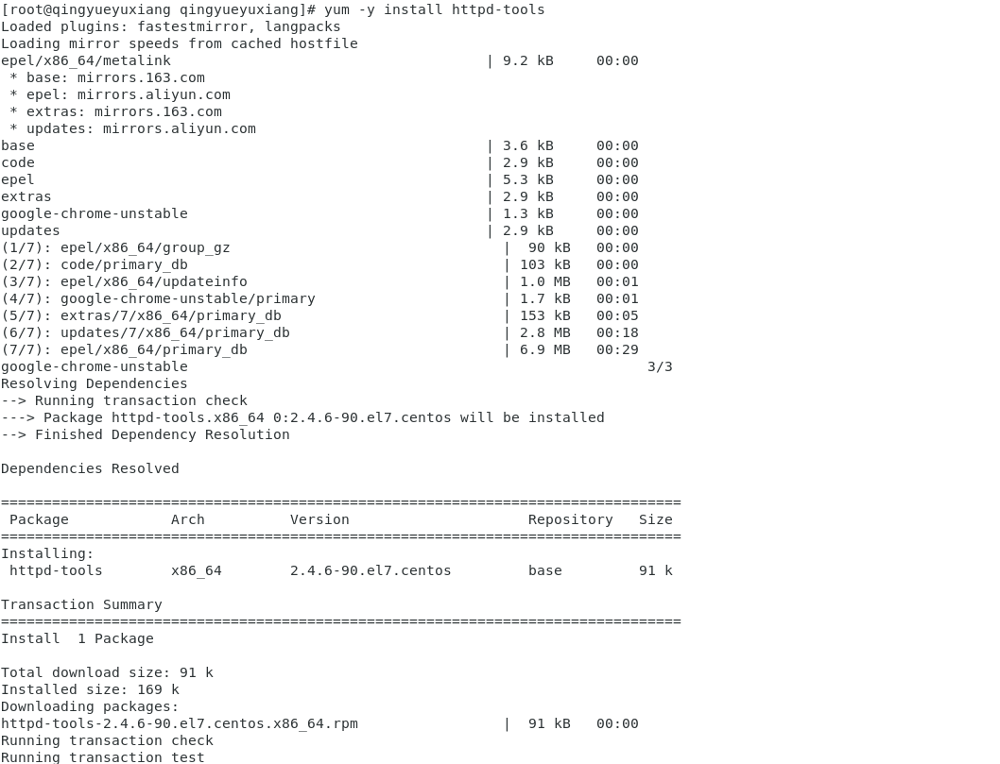
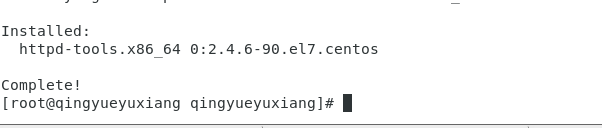
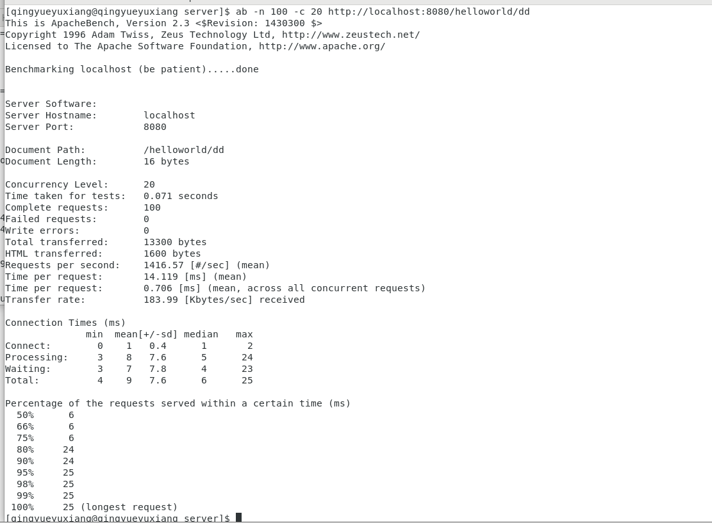

# 开发 web 服务程序cloudgo

<script async src="//busuanzi.ibruce.info/busuanzi/2.3/busuanzi.pure.mini.js"></script>
<span id="busuanzi_container_page_pv">本文总阅读量<span id="busuanzi_value_page_pv"></span>次</span>

## 前言

本次实验是服务计算课程的第五次实验，是开发简单 web 服务程序 cloudgo，并从中了解 web 服务器工作原理的一次实验。

---

文章目录

- [前言](#前言)
    - [1. 概述](#1.概述)   
    - [2. 任务要求](#2.任务要求)
    - [3. 实现](#3.实现)    
    - [4. 实验总结](#4.实验总结)

---

## 1.概述

开发简单 web 服务程序 cloudgo，了解 web 服务器工作原理。

  - 任务目标

  1. 熟悉 go 服务器工作原理
  
  2. 基于现有 web 库，编写一个简单 web 应用类似 cloudgo。
  
  3. 使用 curl 工具访问 web 程序
  
  4. 对 web 执行压力测试

  - 相关知识

  课件：http://blog.csdn.net/pmlpml/article/details/78404838

## 2.任务要求

  - 基本要求

  1. 编程 web 服务程序 类似 cloudgo 应用。

  - 要求有详细的注释

  - 是否使用框架、选哪个框架自己决定 请在 README.md 说明你决策的依据

  2. 使用 curl 测试，将测试结果写入 README.md

  3. 使用 ab 测试，将测试结果写入 README.md。并解释重要参数。

  - 扩展要求

  1. 


## 3.实现

### 实验环境

  - centos 7

  - 采用的是Golang的Martini框架


### 安装martini

```
go get github.com/go-martini/martini
```

<div align=center></div>

### 服务端

  - Martini服务框架，可以直接使用框架内置的classicMartini

  - 生成martini实例

  ```go
  m := martini.Classic()
  ```

  - 注册路由

  ```go
     m.Get("/helloworld/:name", func(params martini.Params) string {
		return "hello world " + params["name"] + "!\n"
	})

	m.Get("/helloNum/:num", func(params martini.Params) string {
		return "hello NO. " + params["num"] + "...\n"
	})

	m.Get("/:nothing", func(params martini.Params) string {
		return "nothing hanppen: " + params["nothing"] + "?\n"
	})
  ```

  此处定义三种不同的路由及相关的处理函数便于测试。

  - 启动监听

  ```go
    m.RunOnAddr(":" + port)
  ```
  其中port是`func NewServer(port string)`的参数端口号

  - 在main.go中：

  - 利用os.Getenv()获取系统环境变量：

  ```go
    port := os.Getenv("PORT")
  ```

  - 若获取后为空，则设定为8080默认端口，即设定的下述const变量：

  ```go
    const (
        // PORT - 8080 default port
        PORT string = "8080"
    )
    if len(port) == 0 {
        port = PORT
    }
  ```

  - 最后通过pflag进行绑定设置并解析,并进行端口绑定

  ```go
    pPort := pflag.StringP("port", "p", PORT, "PORT for http listening")
    pflag.Parse()
    if len(*pPort) != 0 {
		port = *pPort
	}
  ```

  - 最后利用上面实现了的sever包启动服务器：

  ```go
     server.NewServer(port)
  ```

### 效果

  - 安装server包

  ```
    go install server.go
  ```

  <div align=center></div>


  - 上述有默认端口设置，故直接

  ```
    go run main.go 
  ```
  即可。

  - 然后在浏览器中输入`localhost:8080/helloworld/test`进行测试

  <div align=center></div>

  - 输入`localhost:8080/helloNum/test1`

  <div align=center></div>

  - 输入`localhost:8080/test2`

  <div align=center></div>

### curl 测试

  - 输入

  ```
    curl localhost:8080/helloworld/d
  ```

  - 结果(基本与在浏览器测试一致，只是换做命令行展示)：

  <div align=center></div>

  - -v 版

  <div align=center></div>

  如图。

### ab 测试及重要参数解释

  - 首先需要安装相关工具

  ```
    yum -y install httpd-tools
  ```

  <div align=center></div>
  <div align=center></div>

  - 输入

  ```
    ab -n 100 -c 20 http://localhost:8080/helloworld/dd
  ```
  其中-n是请求总数参数，-c是并发用户数参数

  - 结果

  <div align=center></div>

  - 重要参数解释(参考[此篇](https://blog.csdn.net/heyuqing32/article/details/82085661))

    - Server Software: 

      服务器名称，此处空

    - Server Hostname:

      请求服务器的url地址，此处为localhost

    - Server Port:

      请求的端口号，此处为8080

    - Document Path:

      请求的URL中的根绝对路径，通过该文件的后缀名，我们一般可以了解该请求的类型，此处为/helloworld/dd

    - Document Length:

      HTTP响应数据的正文长度，此处为16bytes

    - Concurrency Level:

      并发用户数，这是设置的参数-c，此处是20

    - Time taken for tests:

      所有这些请求被处理完成所花费的总时间，此处为0.071seconds

    - Complete requests:

      总请求数量，这是我们设置的参数-n，此处时为100

    - Failed requests:

      表示失败的请求数量，这里的失败是指请求在连接服务器、发送数据等环节发生异常，以及无响应后超时的情况，此处数量为0

    - Write errors:

      写入错误数量，此处数量为0

    - Total transferred:

      所有请求的响应数据长度总和。包括每个HTTP响应数据的头信息和正文数据的长度，此处为13300bytes

    - HTML transferred:

      所有请求的响应数据中正文数据的总和，即Total transferred - HTTP响应数据中的头信息的长度，此处为1600bytes

    - Requests per second:  
    
      吞吐率，总请求数/处理这些请求所花费的时间，此处为1416.57
    
    - Time per request: 14.119 [ms] (mean)

      用户平均请求等待时间，此处为14.119ms

    - Time per request: 0.706 [ms] (mean across all concurrent requests)

      服务器平均请求等待时间，此处为0.706ms

    - Transfer rate:

      这些请求在单位时间内从服务器获取的数据长度，此处为183.99 Kbytes/sec

## 4.实验总结

  本次实验是基于web服务器的一次实验，涉及内容丰富，所获颇丰。