# Docker 容器技术：1-6章学习

<script async src="//busuanzi.ibruce.info/busuanzi/2.3/busuanzi.pure.mini.js"></script>
<span id="busuanzi_container_page_pv">本文总阅读量<span id="busuanzi_value_page_pv"></span>次</span>

## 前言

本次实验是服务计算课程的第八次实验，是以初步学习Docker容器技术为主的一次实验。

文章目录

- [前言](#前言)
    - [实验过程](##实验过程)
        - [一、准备Docker环境](###一、准备Docker环境)   
        - [二、运行第一个容器](###二、运行第一个容器)
        - [三、docker基本操作](###三、docker基本操作)
        - [四、MySQL(**镜像**)与容器化](###四、MySQL(**镜像**)与容器化)
        - [五、使用MySQL**容器**](###五、使用MySQL**容器**)
        - [六、Docker网络](###六、Docker网络)
        - [七、Docker存储](###七、Docker存储)
    - [实验总结](##实验总结)    
    

## 实验过程

### 一、准备Docker环境

- 安装所需的软件包，`yum-utils`提供了`yum-config-manager`，以及`device-mapper-persistent-data`和`lvm2`都需要存储驱动`devicemapper `。

    ```
    $ sudo yum install -y yum-utils \
    device-mapper-persistent-data \
    lvm2
    ```

    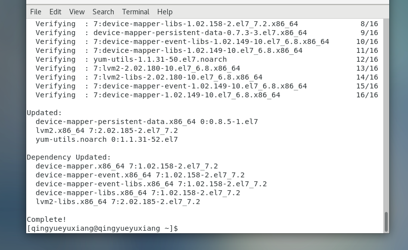

- 设置稳定的数据源

    ```
    $ sudo yum-config-manager \
    --add-repo \
    https://download.docker.com/linux/centos/docker-ce.repo
    ```

    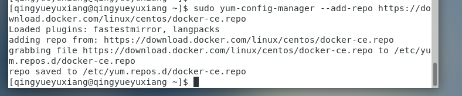

- 安装DOCKER ENGINE - COMMUNITY

    ```
    sudo yum install docker-ce docker-ce-cli containerd.io
    ```

    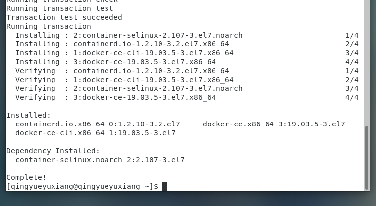

- 检查docker安装

    ```
    $ sudo docker version
    ```

    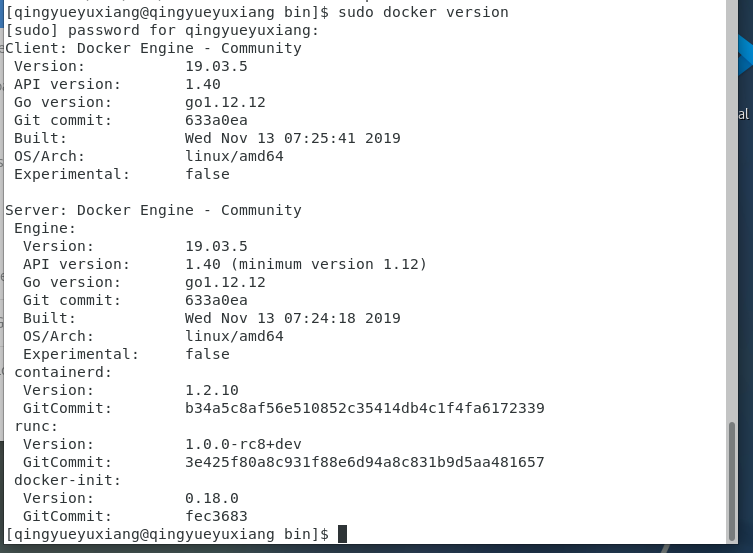

### 二、运行第一个容器

- 测试启动Docker以及运行helloworld，运行后会出现hello-world本地不存在的情况，但会立即从网络上拉取。

    ```
    $ sudo systemctl start docker
    $ sudo docker run hello-world
    ```

    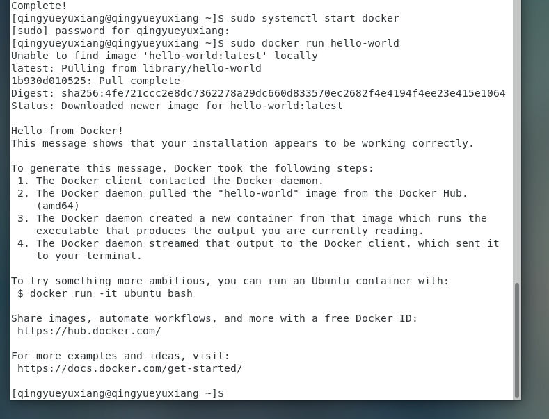

- 运行Ubuntu镜像容器

    ```
    $ sudo docker run -it ubuntu bash
    ```

    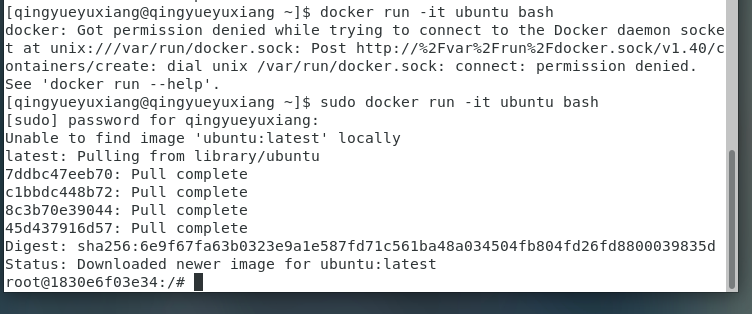

### 三、docker基本操作

- 显示本地镜像库内容

    ```
    $ sudo docker images
    ```

    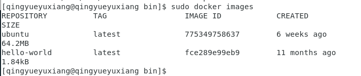

- 获得帮助

    ```
    $ sudo docker --help
    ```

    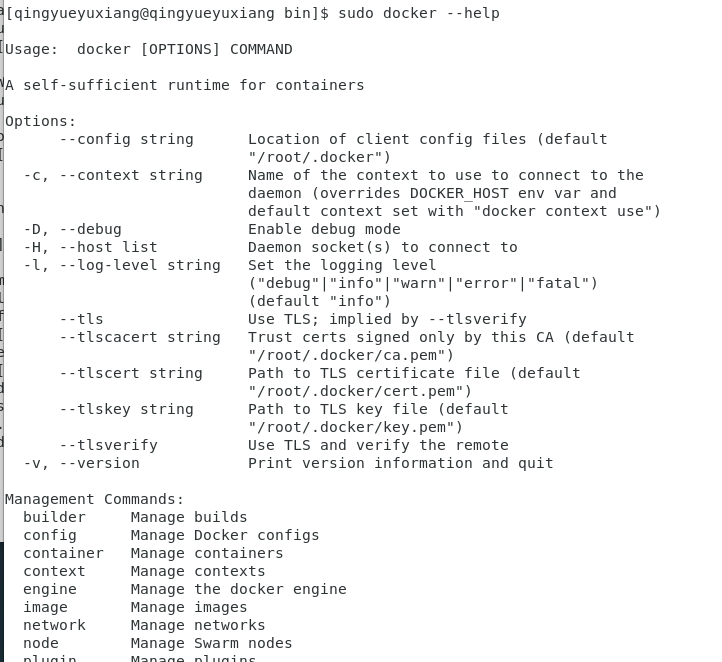

- `docker images`  等价于 `docker image ls`

    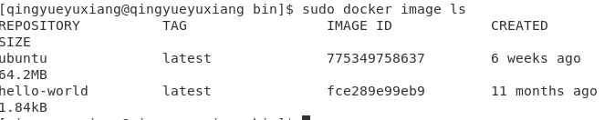

- 显示运行中容器

    ```
    $ sudo docker ps
    或
    $ sudo docker container ls
    ```

    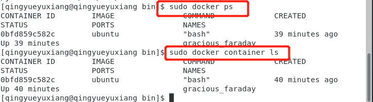

- 显示所有容器（包含已中止）

    ```
    $ sudo docker ps -a
    ```

    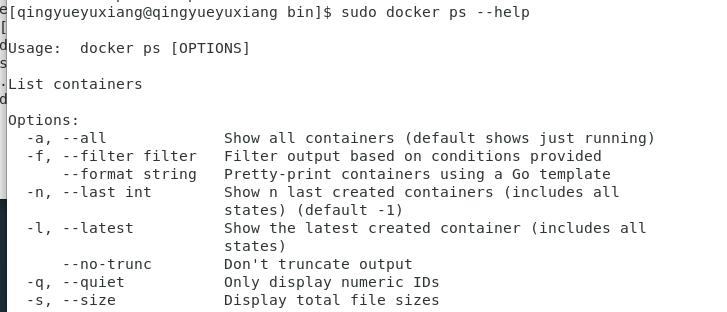

    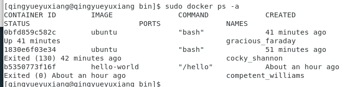

- 继续运行原容器并进入

    ```
    $ docker restart frosty_goodall
    $ docker ps
    $ docker attach frosty_goodall
    ```
    
    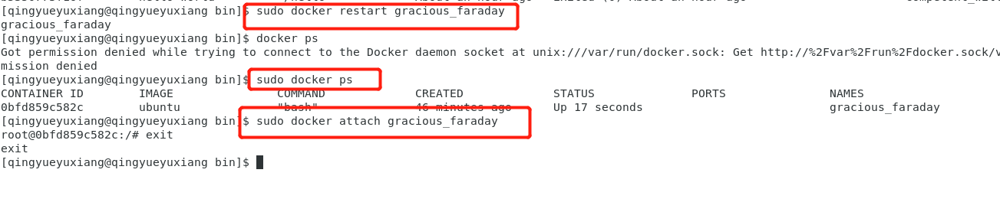

### 四、MySQL(**镜像**)与容器化

- 拉取 MySQL 镜像

    ```
    $ sudo docker pull mysql:5.7
    ```

    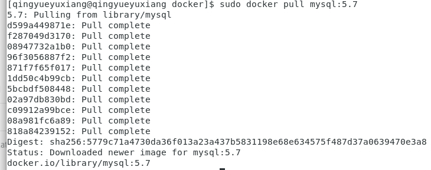

- 构建docker镜像练习

  - 首先修改镜像源为阿里云(**默认的源在本虚拟机上速度较慢**)

    ```
    $ sudo vi etc/docker/daemon.json

    修改(添加)为:
    {
        "regisrty-mirrors": ["http://hub-mirror.c.163.com"]
    }


    $ sudo systemctl restart docker.service
    ```

    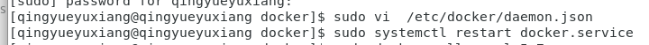

    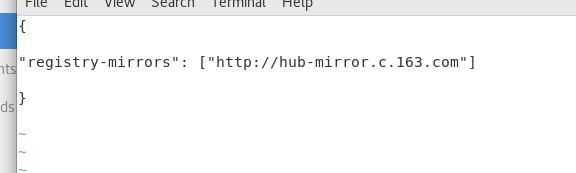

  - 写入内容
    ```
    $ sudo mkdir mydock && cd mydock
    $ sudo vi dockerfile
    ```
    录入内容为:

    ```
    FROM ubuntu
    ENTRYPOINT ["top", "-b"]
    CMD ["-c"]
    ```

    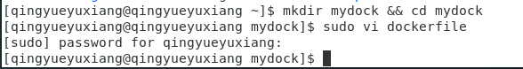

    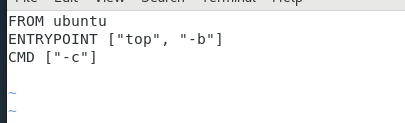

  - 构建镜像

    ```
    $ sudo docker build . -t hello
    ```

    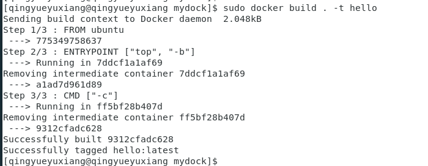

  - 运行镜像

    ```
    $ sudo docker run -it --rm hello -H  
    ```

    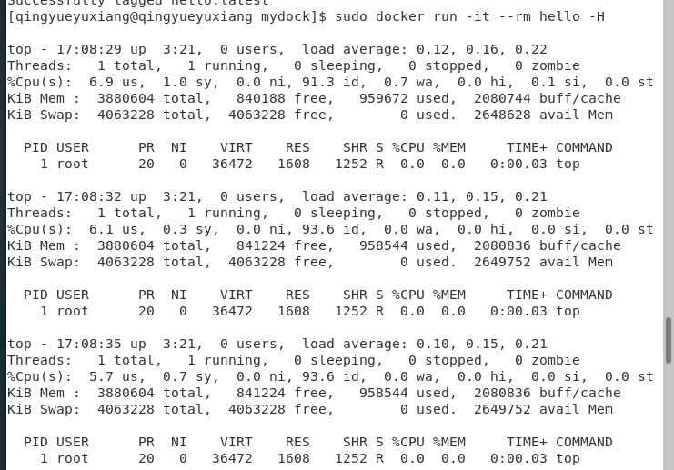

### 五、使用MySQL**容器**

- 启动服务器

    ```
    $ sudo docker run -p 3306:3306 --name mysql2 -e MYSQL_ROOT_PASSWORD=root -d mysql:5.7
    ```

    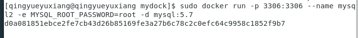

- 查看

    ```
    $ sudo docker ps
    ```

    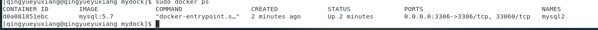


- 启动 MySQL 客户端且在客户端中运行：

    ```
    $ sudo docker run -it --net host mysql:5.7 "sh"
    # mysql -h127.0.0.1 -P3306 -uroot -proot
    ```

    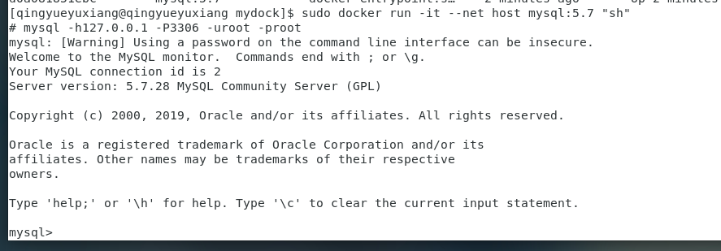

- MySQL的基本操作(创建数据库、创建表等)——基于[此篇](https://blog.csdn.net/pmlpml/article/details/78602290):

    输入：
    
    ```
    create database test;
    use test;

    CREATE TABLE `userinfo` (
        `uid` INT(10) NOT NULL AUTO_INCREMENT,
        `username` VARCHAR(64) NULL DEFAULT NULL,
        `departname` VARCHAR(64) NULL DEFAULT NULL,
        `created` DATE NULL DEFAULT NULL,
        PRIMARY KEY (`uid`)
    );

    CREATE TABLE `userdetail` (
        `uid` INT(10) NOT NULL DEFAULT '0',
        `intro` TEXT NULL,
        `profile` TEXT NULL,
        PRIMARY KEY (`uid`)
    );
    ```

    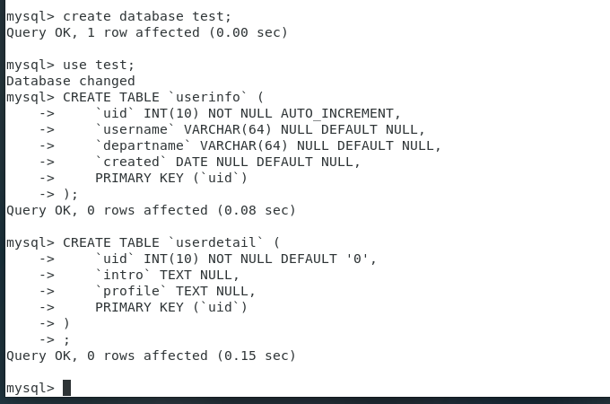

- 使用MySQL容器（挂载卷保存db）

    ```c
    // 查看数据库文件(位置)信息
    $ sudo docker exec -it mysql2 bash
    ```

    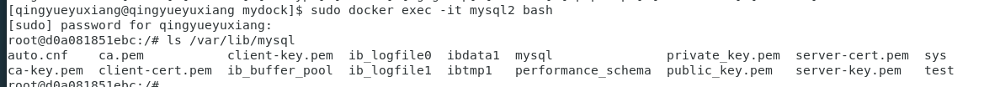

- Dockerfile 的 VOLUME /var/lib/mysql 的含义

    ```
    $ sudo docker container prune -f
    $ sudo docker volume prune –f
    $ sudo docker volume ls
    ```

    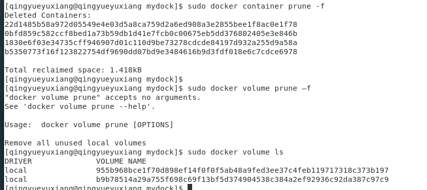

- 创建卷并挂载

    ```
    $ sudo docker rm $(docker ps -a -q) -f -v
    $ sudo docker volume create mydb
    $ sudo docker run --name mysql2 -e MYSQL_ROOT_PASSWORD=root -v mydb:/var/lib/mysql -d mysql:5.7
    ```

    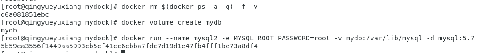

- 启动客户端容器链接服务器

    ```
    $ sudo docker run --name myclient --link mysql2:mysql -it mysql:5.7 bash
    # env
    # mysql -hmysql -P3306 -uroot -proot
    ```

    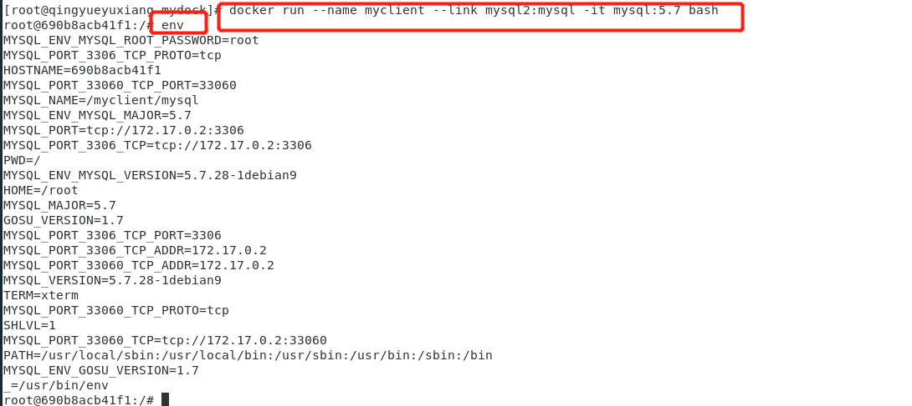

    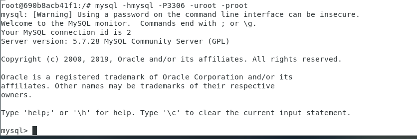

### 六、Docker网络

- 管理容器网络

    ```
    # docker network ls
    ```

    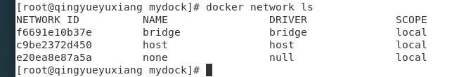

- 备制支持 ifconfig 和 ping 命令的 ubuntu 容器

    ```
    # docker run --name unet -it --rm ubuntu bash
        # apt-get update
        # apt-get install net-tools
        # apt-get install iputils-ping -y
        # ifconfig
    ```

    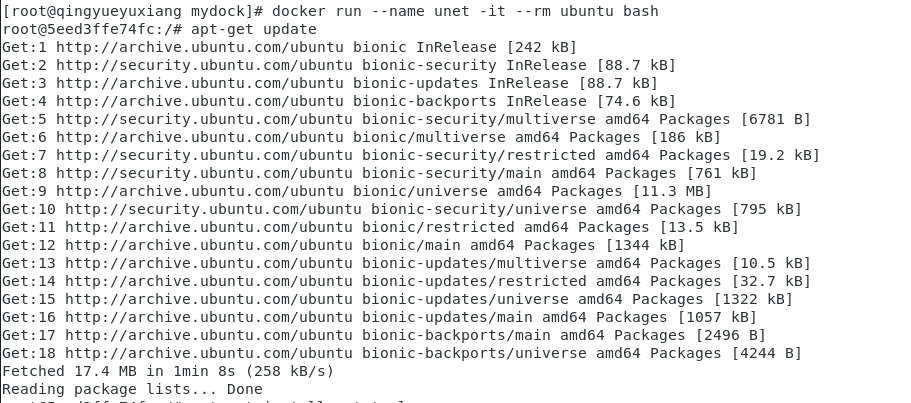

    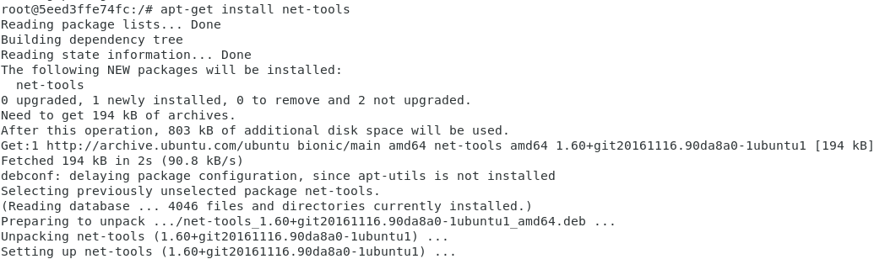

    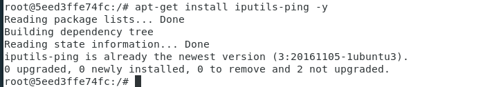

    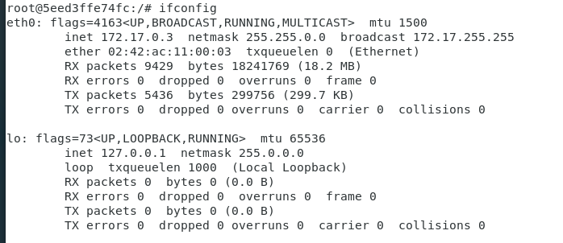

- ping虚拟主机

  - 查看虚拟主机ip

    ```
    $ ip addr
    ```

    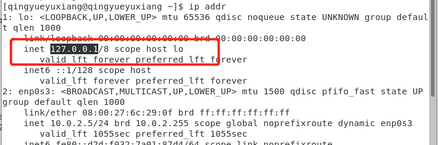

    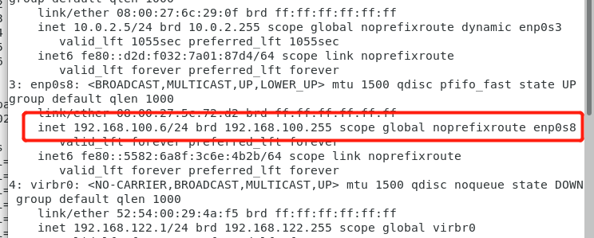

  - ping

    ```
    # ping 127.0.0.1
    # ping 192.168.100.6
    ```

    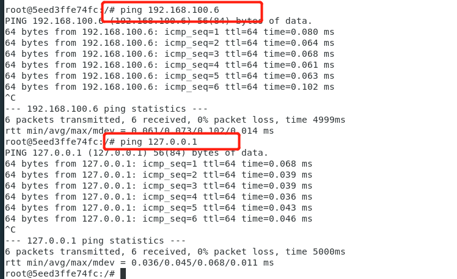

- 启动另一个命令窗口，由容器制作镜像

    ```
    # docker commit unet ubuntu:net
    ```

    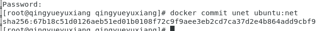

- 创建自定义网络

    ```
    # docker network create mynet
    ```

    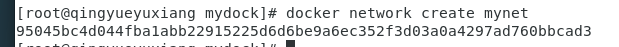

- 在两个窗口创建 u1,u2 容器网络，并使用以下命令 

    ```
    # docker run --name u1 -it -p 8080:80 --net mynet --rm ubuntu:net bash
    # docker run --name u2 --net mynet -it --rm ubuntu:net bash
    # docker info u1
    # docker network connect bridge u1
    # docker network disconnect mynet u1
    ```

    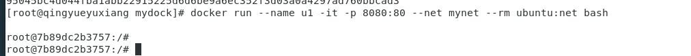

    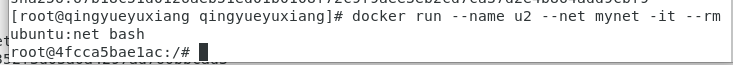

    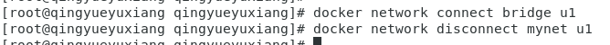

- 其中在输入指令`# docker network disconnect mynet u1`前：

    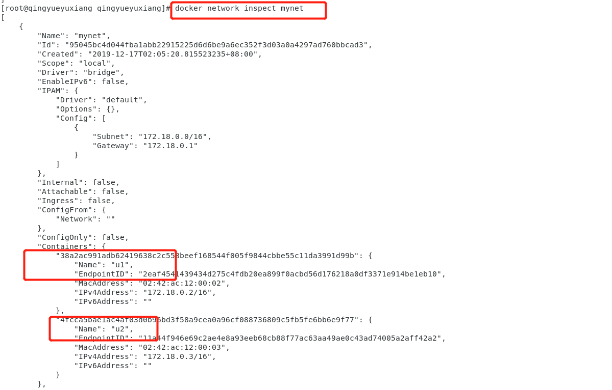

- 在输入指令`# docker network disconnect mynet u1`后：

    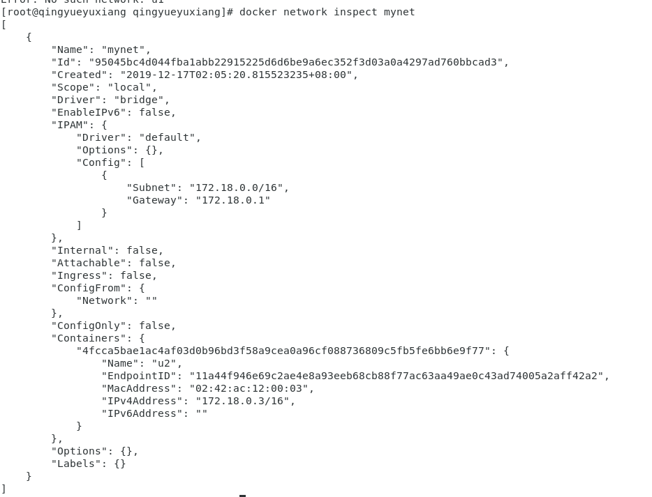

### 七、Docker存储

- 创建$HOME/htdocs/index.html，并输入相关内容

    ```
    # mkdir htdocs
    # cd htdocs/
    # touch index.html
    # gedit index.html

    输入:
    <html><body><h1>This is a file in host file system !</h1></body></html>
    ```

    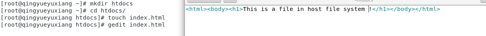

- 通过 -v 将其 mount 到 httpd 容器

    ```
    # docker run -d -p 80:80 -v $HOME/htdocs:/usr/local/apache2/htdocs httpd
    ```

    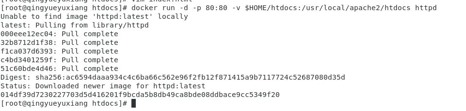

- 验证：

    ```
    # curl 127.0.0.1:80
    ```

    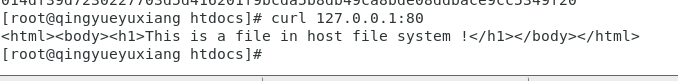

- 更新一下，看是否能生效：

    ```
    # echo "update index page\!" > $HOME/htdocs/index.html
    # curl 127.0.0.1:80
    ```

    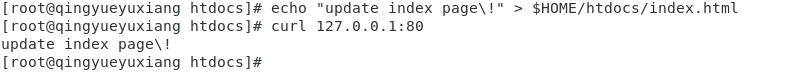

- host中的修改确实生效了。

- 用 volume container 共享数据

- 创建容器并命名为 vc_data 并 mount 了两个 volume

    ```
    $ sudo docker create --name vc_data -v $HOME/htdocs:/usr/local/apache2/htdocs -v $HOME/
    ```
    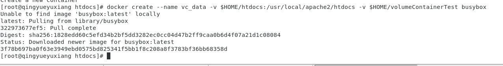

- 查看此两个`volume`：

    ```
    # docker inspect vc_data
    ```

    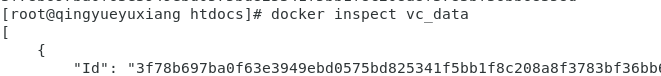

    

- 其他容器可以通过 --volumes-from 使用 vc_data 这个 volume container(`首先创建web1`):

    ```
    # docker run --name web1 -d -p 80 --volumes-from vc_data httpd
    ```
    

- 查看 `web1`

    ```
    # docker inspect web1
    ```

    

    如图显示，`web1`使用了`vc_data`：

    

- 此时查看`docker ps`

    ```
    # docker ps
    ```
    
    

- 进行数据修改测试(其中`127.0.0.1:32768`中的`32768`端口号是`web1`的端口号):

    ```
    # echo "This content is from a volume container." > $HOME/htdocs/index.html
    # curl 127.0.0.1:32768
    ```

    

- 再次创建一个`web2`并查看，且进行测试(此时其中`127.0.0.1:32769`中的`32769`端口号是`web2`的端口号)：

    ```
    # docker run --name web2 -d -p 80 --volumes-from vc_data httpd
    # curl 127.0.0.1:32769
    ```
    
    

- 成功共享

## 实验总结

  - 本次实验主要是在课堂简要介绍Docker相关理念和基本技术的基础上，自行对[《每天5分钟玩转 Docker 容器技术》](https://www.jianshu.com/p/657687b801f0) 前6章进行学习，然后按照课件上的内容进行实践的一次实验，由于课件上对于`存储`方面的内容涉及较少，因此我的实践是参考该教程网站上的部分内容开展的。

  - 总而言之，本次实验我收获颇丰。